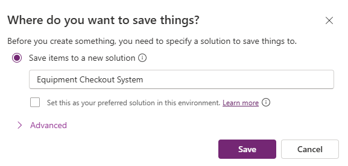
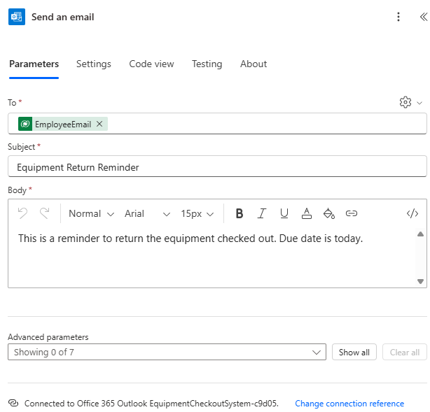

---
lab:
  title: 'ラボ 1: プラン デザイナーを使用してソリューションを作成する'
  learning path: 'Learning Path: Describe the business value of Microsoft Power Platform'
  module: 'Module 1: Describe the business value of extending business solutions by using Microsoft Power Platform'
---

# 実習ラボ 1 - プラン デザイナーを使用してソリューションを作成する 

## 学習の目的:

この演習では、学習者はプラン デザイナーを使用して、アプリ、ワークフロー、エージェントなどを含めることができる完全なターゲット ビジネス ソリューションを構築します。 ソリューションを作成するプロセス全体が、Copilot で案内されます。

**このラボを完了すると、次のことができるようになります。**

-   プラン デザイナーを使用してソリューションをビルドします。
-   データ エージェントを使用してデータ モデルをビルドします。
-   ソリューション エージェントを使用して、必要なさまざまなコンポーネントを生成します。

## シナリオ:

Contoso Consulting は、IT および AI コンサルティング サービスに特化したプロフェッショナル サービス組織です。 ハイブリッドワーク モデルに切り替えたため、Contoso の従業員の多くは在宅勤務です。 従業員に頻繁に機器を貸し出す必要があるため、課題が生じます。

Contoso では、Power Platform を使用して、機器の返却と貸し出しを管理するソリューションをビルドしたいと考えています。

この演習では、Microsoft Power Platform のプラン デザイナーを使用して、解決しようとしているビジネス上の課題の説明を提供し、推奨事項を使用してソリューションを作成します

> [!IMPORTANT]
> このラボでは AI を使用してコンポーネントを構築します。 AI の結果は異なる可能性があるため、結果がラボで定義されたものと異なる (ただし似ている) 場合があることに注意してください。 ラボで概説されている基本的な概念は、何が作成されたか、またはどのような名前が付けられたかに関係なく同じです。 提案または作成されたオブジェクトが指示に記載されているものと正確に一致しない場合は、作成された内容に基づいて調整が必要になることがあります。

## ラボのスケジュール:

この演習の推定所要時間は **20 から 30** 分です。

## タスク 1:プラン デザイナーを使用してソリューション計画を作成する

プラン デザイナーを使用する

1.  [Power Apps Maker](https://make.powerapps.com) Portal を開き、**[ホーム]** 画面に移動します。
2.  **[計画を立てましょう]** で、次のテキストを入力します: `I need my staff to check out equipment and be notified of due dates.`

    

3.  **[移動]** ボタンを選択します。
4.  プラン デザイナーでは、指定した説明に基づいて計画が作成されます。 計画には次の内容が含まれます。
    -   ビジネス上の問題
    -   この計画の目的
    -   ユーザーの要件

**要件エージェント**では、指定した説明に基づいてユーザー要件が構築されます。計画の開始点として考慮する必要があります。 必要に応じて要件を変更できます。

5.  要件を変更するには、**[編集]** ボタンを選択します。
6.  見出し **[ユーザーの要件]** の下にある **[Copilot]** フィールドに、次のように入力します: `Staff should be able to report if there is an issue with the equipment while they have it checked out`
7.  **[移動]** ボタンを選択します。

新しい問題報告要件が計画に追加されます。

8.  要件が正常に一覧表示されたら、**[保持]** ボタンを選択します。
9.  **[要件エージェント]** で生成された要件に満足できる場合は **[良好]** を選択します。

次に、**[データ モデル エージェント]** では、データ モデルの作成が支援されます。 ソリューションのデータを格納するために作成する必要があるテーブルが提案されます。

10.  モデルの詳細を表示するには、**[詳細の表示]** を選択します。

推奨されるすべてのテーブル、列、リレーションシップがデータ モデル デザイナーに表示されます。 [Copilot] ペインを使用して、データ モデルを変更できます。

11.  画面右側の **[Copilot]** ペインで、次のように入力します: `Add a text column to the Equipment table called Item number.`
12.  列が**機器**テーブルに追加されたら、**Copilot** を使用して、次のプロンプトを個別に入力します。
    1.  `Add a new text column to the Staff/Employee table called Manager.`
    2.  `Add a new choice column to the Equipment table called Equipment Type.`
    3.  `Add a new choice column to the Equipment table called Equipment Type.`

        データ モデルは、次のようになります。 *(完全には一致しない場合があります。その場合も問題ありません)*

13.  左側のナビゲーションを使用して、**[概要]** アイコンを選択します。 (戻る矢印の下にあります。)**
14.  **[データ エージェント]** で **[良好]** を選択して次の手順に進みます。

次に、**ソリューション エージェント**で、さまざまな項目の提案が提供されます。 今回は、エージェントにより 2 つの Canvas アプリケーション、Power Automate フロー、エージェントの作成が提案されます。 (同じように表示されない場合もあります)**

15.  **ソリューション エージェント**で、**[編集]** ボタンを選択します。
16.  見出し [テクノロジ] の下にある **[Copilot]** フィールドに、次のように入力します: `Create an item checkout agent to answer employee questions.`
17.  **[移動]** ボタンを選択します。
18.  **アイテム貸し出しエージェント**が追加されます。 **[保持]** を選択します。
19.  **ソリューション エージェント**の提案に満足できた場合は、**[良好]** を選択します。
20.  **[テーブルの保存]** を選択し、推奨されているデータ モデルをビルドします。

プラン デザイナーでは、作成するすべてのプランのソリューション ファイルがビルドされます。 ソリューションは、アプリケーション ライフサイクル管理 (ALM) の重要なコンポーネントです。

21.  **[保存場所を指定してください]** 画面で、ソリューションの名前を "機器貸し出しシステム" に設定し、**[保存]** ボタンを選択します。

    

プラン デザイナーによって提案されたすべての項目が作成されるまでに、1 から 3 分程かかる場合があります。 テーブルが保存されたことを示すメッセージが表示されたら、**[X]** を選択して表示メッセージを閉じます。

## タスク 2:プラン ソリューションのアプリを作成および変更する

プラン デザイナーで必要なすべてのテーブルが作成され、オブジェクトを作成するための提案を提供されたので、提案された内容を作成します。 まず、機器貸し出しアプリを構築します。

1.  **機器貸し出しシステム**プランが開かれていることを確認します。
2.  **[プランの概要]** ペインが表示された状態で、折りたたみボタンを選択してモード デザイン領域を表示します。 (概要ウィンドウの右上にあります。)**
3.  **[デザイナー]** ウィンドウで、**機器貸し出しアプリ**を見つけて、**[作成]** ボタンを選択します。 (Power Apps でアプリが迅速にビルドされます)。**

    

アプリケーションが作成されたら、いくつかの基本的な変更を加えます。 その前に、アプリを見てみましょう。

4.  **[スタート画面]** を選択します。 (予約、貸し出し、拡張機能などの項目へのクイック アクセスが提供されます。)**
5.  **[エンティティの予約/貸し出し]** 画面を選択します。 (予約/貸し出しの新規作成、表示、編集、削除を行うことができます)。**
6.  **[延長のリクエスト]** や **[通知]** (またはアプリ用に作成したいずれかの画面) などのその他の画面に移動します。**
7.  **[スタート画面]** を選択します。
8.  **[エンティティの予約/貸し出し]** の上の図を選択します。
9.  表示されるメニューから、**[編集]** \> **[ストック画像]** を選択します。
10.  **[検索]** ボックスに「**機器**」と入力します。
11.  一覧から推奨された画像のいずれかを選択し、**[挿入]** ボタンを選択します。 (***省略可能: 必要に応じて、残りの画像に対しても繰り返します)*** **
12.  [エンティティの予約/貸し出し] テキストの下にある **[説明]** を選択します。
13. **コマンド バー**の **[プロパティ]** ボタンを選択します。 ([編集] ボタンのすぐ右にあります。)**
14. **Text** プロパティを `Start a new or view an existing reservation.` に変更します
15. **エンティティの予約/貸し出し**のテキストを選択します。
16. Text プロパティを `Reserve Equipment.` に変更します
17. 画面の上部にある **[スタート画面]** テキストを選択します。
18. **Text** プロパティを `Contoso Equipment Checkout.` に変更します
19. **[プロパティ]** ペインの **[スタイルとテーマ]** で、塗りつぶしの色を **[ダーク ブルー]** に変更します。 **[スタッフ]** の上にある画像を選択します。

アプリの **[スタート画面]** は次の画像のようになります。

![機器貸し出しアプリの [スタート画面] のスクリーンショット。](media/468c45173687629c1de22589e7e140c0.png)

追加の変更は必要に応じて行うことができますが、ここではアプリケーションをテストします。

20.  コマンド バーで、**[再生]** アイコンを選択します。 (画面サイズに応じてアプリのレイアウトが変更されることに注目してください)**
21.  **[機器の予約]** イメージを選択します。
22.  レコードを編集するには、**編集**ボタンを選択します。
23.  レコードの **[名前]** を変更します。
24.  **[チェック マーク]** アイコンを選択して変更を保存します。
25.  **[ホーム]** ボタンを選択して、**[スタート画面]** に戻ります。
26.  アプリの右上隅にある**紫色の [X]** を選択してデザイナーに戻ります。
27.  **コマンド バー**で **[保存]** アイコンを選択してアプリを保存します。
28.  **[ブラウザー]** タブを閉じて、**[デザイン プランナー]** に戻ります。 (アプリの下のボタンが [作成] から [編集] に変更されました)**

> [!NOTE]
> 上記の手順を繰り返す場合は、機器管理アプリも同様に作成および変更することができます。

## タスク 3:提案されたフローを作成する

プラン デザイナーで提案されたアプリに加えて、リマインダー通知フローも提案されている可能性があります。 次に、提案されたフローを作成します。

1.  **[デザイン]** ウィンドウで、**リマインダー通知フロー**を見つけて **[作成]** ボタンを選択します。 (Power Automate フロー デザイナーが開きます)**
2.  **[提案されたフロー]** が表示されるので、**[保持して続行する]** を選択します。
3.  **[接続されているアプリとサービスを確認する]** 画面で、すべての接続に緑色のチェック マークがあることを確認し、**[フローの作成]** ボタンを選択します。

作成されるフローは、毎日実行される定期的なフローであり、返却期限が今日のアイテムを特定し、各アイテムを貸し出した個人宛てにメールを送信します。

4.  **[繰り返し]** トリガーを選択します。
5.  トリガーが自動的に **[サイクル間隔]** が **1**、**[頻度]** が日次に構成されていることに注目してください。 (実行する必要がある特定の時刻を指定することもできます)。**

    

6.  **list rows** ステップを選択します。

この手順では、データ モデルの一部として作成された**通知**テーブルを確認し、**今日**の**期日**を持つレコードを識別します。

7.  **[テーブル名]** フィールドに値がある場合は、削除します。
8.  **[テーブル名]** フィールドに「**通知**」と入力し、環境内の**通知 [cX\#X\#_notifications]** または同様の名前の項目を選択します。

    

9.  **For Each** ステップを選択します。
10.  **List Rows** ステップで特定された各レコードについて、フローにより、アイテムが貸し出された従業員のメール アドレスにメールを送信され、そのアイテムの返却期日が今日であることがリマインドされます。

    

> [!IMPORTANT]
> メールのステップにデータが含まれていることを確認します。 データが含まれていない場合は、エラーが発生します。 データがない場合は、上記の画像と一致するようにステップのフィールドに入力します。 必要に応じて、[宛先] フィールドに独自のメール アドレスを入力できます。

フローに適合するように、追加の変更を加えることもできます。 ここでは、そのままにしておきます。

11.  **コマンド バー**で、**[下書きを保存]** ボタンを選択します。
12.  **[発行]** ボタンを選びます。
13.  **[ブラウザー]** タブを閉じて、**[プラン デザイナー]** タブに戻ります。
14.  **[リマインダー通知フロー]** の横に **[編集]** アイコンが表示されたことに注目してください。

## タスク 4:アイテム貸し出しエージェントを作成する

最後に、ユーザーが予約などの質問に回答するために利用できるアイテム貸し出しエージェントの提案がプラン デザイナーから提供されました。

1.  **[デザイン]** ウィンドウで、**アイテム貸し出しエージェント**を見つけて **[作成]** ボタンを選択します。 (Copilot Studio が開きます)**

    Copilot Studio によって、ソリューション内のテーブルに基づいてエージェントにナレッジが追加されます。 必要に応じて、付加的な知識を追加できます。 本日は、エージェントをそのまま残します。

2.  **[エージェントをテストする]** ペインで、次のように入力します: `Does Bob Johnson have any overdue items checked out?`
3.  エージェントから、テーブル内のデータに基づいた応答が返されます。

    

4.  **Copilot Studio** で、**[発行]** ボタンを選択します。
5.  **[このエージェントの発行]** 画面で、**[発行]** ボタンを選択します。
6.  **[ブラウザー]** タブを閉じて、**[プラン デザイナー]** に戻ります。

## タスク 5:プランを保存する

1.  プランで、**[保存]** ボタンを選択して保存します。
2.  保存が完了したら、**戻る矢印**ボタンを選択して、**Power Apps** Maker Portal に戻ります。
3.  左側のナビゲーションを使って、**[計画]** を選択します。
4.  **機器貸し出しシステム**プランが一覧表示されていることに注目してください。
5.  **機器貸し出しシステム**プランを選択して、エディターでプランのバックアップを開きます。

