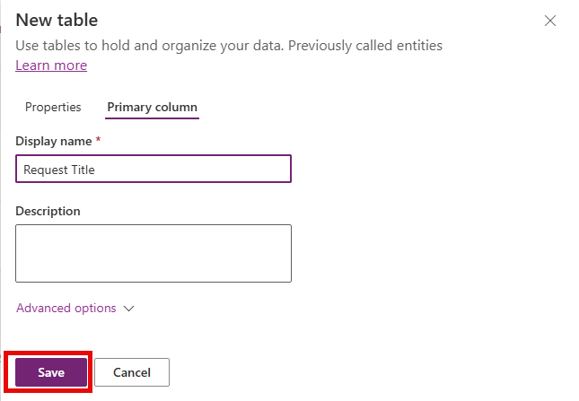
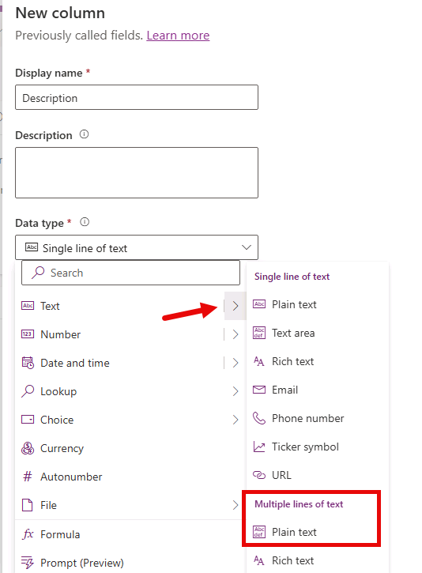
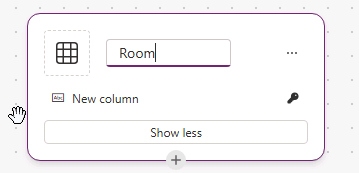
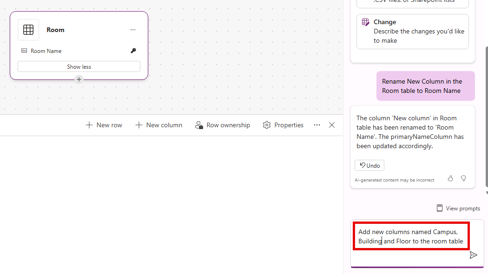

---
lab:
  title: 'ラボ 1: データ モデルを作成する'
  learning path: 'Learning Path: Manage the Microsoft Power Platform environment'
  module: Describe Microsoft Dataverse
  description: このラボでは、学習者は Microsoft Dataverse でデータ モデルを作成します。 さまざまな列の型を持つカスタム Facility Request テーブルを作成し、Copilot を使用して Room テーブルを作成し、ルックアップ リレーションシップを追加します。
  duration: 30 minutes
  level: 100
  islab: true
---

# 実習ラボ 1 - データ モデルを作成する

**[推定時間]**: 30 分

## はじめに

PL-900: Microsoft Power Platform 基礎ハンズオン ラボ ガイドへようこそ。 これらのラボは、Microsoft Power Platform のコア コンポーネントに関する実用的な入門エクスペリエンスを提供するように設計されています。

## ラボ シナリオ: Contoso の施設要求

これらのラボでは、共通のビジネス シナリオに基づいて作業します。Contoso Corporation では、従業員が施設とメンテナンスの要求 (機器の故障、会議室のセットアップ、供給注文など) を送信するためのシンプルなシステムが必要です。 施設チームは、これらの要求を追跡、優先順位付け、解決する必要があります。

各ラボでは、異なる Power Platform コンポーネントを使用して、このソリューションの異なる部分を構築します。 ラボはテーマが関連していますが、各ラボは自己完結型であり、任意の順序で個別に完了できます。

## 前提条件

これらのラボを開始する前に、以下を必ず取得してください。

-   Power Platform アクセス権を持つ Microsoft 365 アカウント (試用版環境でもかまいません)
-   Dataverse がプロビジョニングされた Power Platform 環境
-   最新の Web ブラウザー (Microsoft Edge または Google Chrome をお勧めします)
-   Power Platform 環境での作成者レベルのアクセス許可

**推定所要時間:30 分**

## ラボの目的

このラボでは、次のことを学びます。

-   Power Apps Maker ポータルで Dataverse 環境内を移動する
-   施設要求データを格納するカスタム テーブルを作成する
-   さまざまなデータ型の列をテーブルに追加する
-   シンプルな選択肢列を作成する
-   新しいテーブルにサンプル データを入力する

## シナリオ

Contoso には、施設要求データを格納するための中央の場所が必要です。 各要求を追跡するために必要とされる主要な情報 (タイトル、説明、カテゴリ、優先度、状態、要求が送信された日付) を取得する、Facility Request という Dataverse テーブルを作成します。

# 演習 1: ゼロからデータ モデルを構築する

## タスク 1: Facility Request テーブルを作成する

1.  <https://make.powerapps.com> に移動し、提供された資格情報でサインインします (これはラボ環境の [リソース] タブから取得できます。**[管理ユーザー名]** と **[管理パスワード]** を使用します)。****
1.  画面の右上隅にある環境ピッカーを確認して、正しい環境 (**Dev One**) になっていることを確かめます。
1.  左側のナビゲーション ウィンドウで、**テーブル**を選択します。
1.  **[+ 新しいテーブル]** ドロップダウンを選択し、表示されるメニューから **[テーブル (詳細プロパティ)]** を選択します
1.  テーブルの **[プロパティ]** パネルで、**[表示名]** を **Facility Request** に設定します。 (注: 複数形の名前は自動的に設定されます。)
1.  **[プライマリ列]** タブを選択し、**[表示名]** を **Request Title** に変更します

    

1.  **[保存]** ボタンを選択して新しいテーブルを作成します。

## タスク 2: テーブルに列を追加する

次に、各要求からの情報を格納するための列をいくつか作成する必要があります。 次の列を追加します。

| **列の表示名** | **データの種類**          | **追加設定**                                        |
|-------------------------|------------------------|----------------------------------------------------------------|
| 説明             | 複数行テキスト | 最大長: 2000                                               |
| Date Requested          | 日付のみ              | 動作: ユーザー ローカル                                           |
| 推定コスト          | 通貨               | "既定値のままにします"                                                 |
| カテゴリ                | 選択肢                 | 選択肢: Maintenance、Equipment、Supplies、Room Setup、Other   |
| 優先順位                | 選択肢                 | 選択肢: Low、Medium、High、Urgent                             |
| 状態                  | 選択肢                 | 選択肢: New、In Progress、Completed、Cancelled (既定値: New) |

1.  **Facility Request** テーブルが Maker Portal で開かれていることを確認します。
1.  **[Facility Request 列とデータ]** で、**[+]** ボタンを選択します。
1.  次のように新しい列を構成します。
    - **表示名:** Description
    - **データ型:** 複数行テキスト (プレーンテキスト)

    

1.  **[高度なオプション]** を展開し、**[最大文字数]** が **2000** になっていることを確認します。
1.  **[保存]** ボタンを選択します。
1.  **[Facility Request 列とデータ]** で、**[+]** ボタンをもう一度選択します。
1.  次のように新しい列を構成します。
    - **表示名:** Date Requested
    - **データ型:** 日付と時刻
    - **形式:** 日付のみ
1.  **[高度なオプション]** を展開し、**[タイム ゾーンの調整]** を **[ユーザー ローカル]** に設定します。
1.  **[保存]** ボタンを選択します。

    

1.  **[Facility Request 列とデータ]** で、**[+]** ボタンをもう一度選択します。
1.  次のように新しい列を構成します。
    - **表示名:** Estimated Cost
    - **データ型**: 通貨
1.  **[保存]** ボタンを選択します。

    

1.  **[Facility Request 列とデータ]** で、**[+]** ボタンをもう一度選択します。
1.  次のように新しい列を構成します。
    - **表示名:** Category
    - **データ型:** Choice (選択肢)
1.  **[グローバル選択肢と同期]** で **[いいえ]** を選択します。
1.  **[選択肢]** で、**[ラベル]** を **Maintenance** に設定します。
1.  **[+ 新しい選択肢]** を選択し、ラベルを **Equipment** に設定します。
1.  次のラベルを追加し終わるまで、最後の手順を繰り返します。
    - 必需品
    - Room Setup
    - その他
1.  **[既定の選択肢]** を **[なし]** に設定します
1.  **[保存]** ボタンを選択します。

    

1.  手順 13 - 20 を繰り返して、次の選択肢列と値を追加します。

| **列の表示名** | **データの種類** | **追加設定**                                        |
|-------------------------|---------------|----------------------------------------------------------------|
| 優先順位                | 選択肢        | 選択肢: Low、Medium、High、Urgent                             |
| 状態                  | 選択肢        | 選択肢: New、In Progress、Completed、Cancelled (既定値: New) |

## タスク 3: サンプル データを入力する

次に、サンプル データを追加します。これにより、テーブルからアプリを構築するときに表示するデータが用意されます。

1.  Facility Request テーブル エディターがまだ開いたままになっていることを確認します。
1.  **[編集]** を選択し、**[+ 新規]** 行を選択 (または最初の空の行をクリック) し、次のサンプル レコードを入力します。

| **Request Title**                | **カテゴリ** | **優先順位** | **Status**  |
|----------------------------------|--------------|--------------|-------------|
| Broken printer in Room 201       | 備品    | 高         | 新しい         |
| Order paper supplies for Floor 3 | 必需品     | 低          | 新しい         |
| Conference room setup for Monday | Room Setup   | Medium       | 進行中 |

1.  各レコードの **Description**、**Date Requested**、**Estimated Cost** 列に適切な値を入力します。
1.  すべてのレコードを入力した後、データがグリッド ビューに正しく表示されていることを確認します。

# 演習 2: Copilot の支援機能を使用してデータ モデルを構築する

Dataverse でテーブルを構築する方法は多数あります。 先ほど行った手動による方法に加えて、Copilot のようなツールを使用して支援を受けることもできます。

> [!IMPORTANT]
> Copilot を使用する場合、結果は変動することがあります。 そのため、具体的な手順をステップバイステップで説明するよりも、実際のエクスペリエンスをより反映したガイダンスを提供することにします。

## タスク 1: Room テーブルを作成する

1.  左側のナビゲーション ウィンドウで、**テーブル**を選択します。
1.  **[テーブル]** で、**[空白のテーブルから開始する]** を選択します
1.  テーブルの名前を **Table1** から **Room** に変更します

    

1.  次に、**[新しい列]** の名前を **Room Name** に変更します。
    - **ヒント:** Copilot ペインで、次のテキストを入力します:  
    > "Room テーブルの新しい列の名前を Room Name に変更してください"。**

次に、テーブルにいくつかの新しい列を追加する必要があります。

以下を追加します。

| **列の表示名** | **データの種類** |
|-------------------------|---------------|
| キャンパス                  | Text          |
| ビルド                | Text          |
| Floor                   | Text          |
| Conference Room         | はい/いいえ        |

1.  Copilot ペインを使用して、上記のすべてのテキスト列を追加します。
    - **ヒント:** 次のテキストを入力します:  
    > "Room テーブルに Campus、Building、Floor という名前の新しい列を追加してください"。**

        

1.  Copilot ペインを使用して、**Conference Room** という**はい/いいえ**列を追加します
    - **ヒント**: 次のテキストを入力します:  
    > "Room テーブルに、Conference Room という名前の新しいはい/いいえ列を追加してください"。**

1.  完成した **Room** テーブルは次の画像のようになります。

    

テーブルを作成したので、次のサンプル データをテーブルに追加しましょう。

| **ルーム** | **Campus** | **Building (建物)**  | **Floor** | **Conference Room** |
|----------|------------|---------------|-----------|---------------------|
| 301 A    | North      | HighPoint     | 3         | はい                 |
| 233      | South      | Seirra        | 2         | いいえ                  |
| 401 B    | East       | Jacobson      | 4         | はい                 |

1.  **[保存して終了]** ボタンを選択して新しい Room テーブルを作成します。

## タスク 2: Facility Request テーブルに会議室ルックアップ フィールドを作成する

次に、Facility Request テーブルにルックアップ列を追加します。これにより、Rooms テーブルから会議室を選択できます。

1.  左側のナビゲーションを使用して、**[テーブル]** を選択します
1.  **[すべて]** を選択し、**[検索]** フィールドに「**Facility**」と入力します。
1.  **Facility Request** テーブルを開きます
1.  **[スキーマ]** の下で、**[列]** を選択します
1.  **[+ 新しい列]** を選択し、次のように構成します。
    - **表示名:** Room    
    - **データ型:** 検索
    - **関連テーブル:** Room

        

1.  **[保存]** ボタンを選択します。

