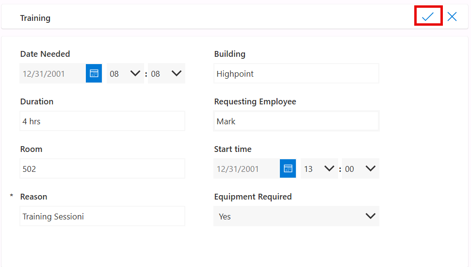
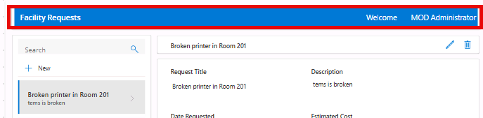
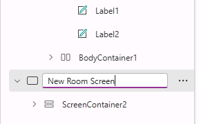
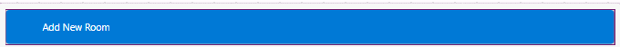

---
lab:
  title: 'ラボ 2: キャンバス アプリを作成する'
  learning path: 'Learning Path: Demonstrate the capabilities of Microsoft Power Apps'
  module: Build a canvas app
  description: このラボでは、Power Apps でキャンバス アプリケーションを作成します。 まず、テンプレートから構築されたアプリを探し、Dataverse データ ソースに接続された施設要求アプリを最初から構築して、画面、ギャラリー、ナビゲーションでカスタマイズします。
  duration: 45 minutes
  level: 100
  islab: true
  primarytopics:
    - Power Apps
---
# 実習ラボ 2 - キャンバス アプリを作成する

**予測される所要時間**: 45 分

## ラボの目的

このラボでは、次のことを学びます。

-   事前構築済みのテンプレートからキャンバス アプリを作成する
-   Power Apps Studio のインターフェイスと主要なコンポーネントについて調べる
-   空白の画面からシンプルなキャンバス アプリを作成する
-   ギャラリー、フォーム、ラベル、ボタンなどのコントロールを追加する
-   キャンバス アプリをデータ ソースとして Dataverse テーブルに接続する
-   
## シナリオ

Contoso は、従業員が施設の要求を表示および申請するために使用できるモバイル対応アプリを必要としています。 最初にテンプレートから構築されたアプリを調べてキャンバス アプリのしくみを理解してから、シンプルな要求申請アプリを最初から構築します。

# 演習 1: テンプレートからアプリを作成する

この演習では、組み込みのテンプレートの 1 つからキャンバス アプリを作成して、完成したアプリの構造を簡単に確認します。

1.  <Https://make.powerapps.com> に移動してサインインします。
1.  **ホーム**画面の、左側のナビゲーション ウィンドウで **[+ 作成]** を選択します。
1.  **[データから開始]** セクションで、**[ファイルのアップロード]** を選択します。
1.  **[Excel ファイルのアップロード]** 画面で、**[デバイスから選択]** ボタンをクリックします。
1.  **[クラス ファイル]** から、**[Room Reservations.xlsx]** を見つけて開きます。

>[!NOTE]
>**[Room Reservations.zip]** のみが表示される場合は、この ZIP ファイルを選択し、**[すべて展開]** を選択し、展開したフォルダーを開いて、**[Room Reservations.xlsx]** を選択します。

6.  **[先頭の行を列見出しとして使用する]** が選択されていることを確認し、**[アプリの作成]** を選択します。

    

    > [!NOTE]
    > [Power Apps Studio へようこそ] 画面が表示されたら、[今後このメッセージを表示しない] を選択し、**[スキップ]** ボタンを選択します。

1.  アプリをテストするには、**[再生]** ボタンを選択します ("[保存] ボタンの左側にあります")。**
1.  新しいレコードを追加するには、**[+ 新規]** ボタンを選択します。
1.  新しいレコードに次の情報を入力します。
    -   **必要な日付:** 明日の日付
    -   **建物:** Highpoint
    -   **期間:** 4 時間
    -   **要求している従業員:** あなたの名前
    -   **ルーム:** 502
    -   **開始時刻:** 明日の午後 1 時
    -   **理由:** トレーニング セッション
    -   **機器が必要かどうか:** はい
10. **[保存]** ボタン (チェック マーク) を選択します

    

1.  プレビュー モードからアプリを閉じます ([X] ボタン)
1.  **[保存]** ボタンを選択します。
1.  **[発行]** ボタンを選びます。
1.  **[このバージョンの発行]** ボタンを選択します

# 演習 2: キャンバス アプリを構築および編集する

次に、Dataverse データ ソースに接続された空白のキャンバスからシンプルな施設要求アプリを構築します。

## タスク 1: アプリを作成してデータと接続する

1.  <Https://make.powerapps.com> に移動します
1.  **ホーム**画面の、左側のナビゲーション ウィンドウで **[+ 作成]** を選択します。
1.  **[データから開始]** セクションで、**[Dataverse]** を選択します。
1.  **[検索]** フィールドに、テキスト「**施設**」を入力します。
1.  **[施設要求]** テーブルを選択し、**[アプリの作成]** を選択します。

    

## タスク 2: 施設要求アプリをカスタマイズする

キャンバス アプリの重要な要素の 1 つは、必要に応じてアプリケーションを変更できることです。 アプリを変更して、ニーズに合わせて少し調整します。

このタスクでは、次のことを行います。

-   既存の要素を書式設定する
-   アプリにウェルカム メッセージを追加する
-   既存のフォームを変更する。
-   新しいルームを追加するための新しい画面を追加する。
-   新しいルーム画面に移動するボタンを追加する。

**画面の右側にウェルカム ユーザー プロンプトを追加する**

まずは、ウェルカム メッセージとログインしているユーザー名が含まれるように、メイン画面をカスタマイズします。

1.  **施設要求の画面** (既定の画面) で、**[施設要求]** ヘッダーを選択します。
1.  **[+ 挿入]** ドロップダウン メニューを選択し、**[テキスト ラベル]** を選択します。
1.  **[テキスト ラベル]** フィールドの **[値]** を「**ようこそ**」に設定します
1.  **[テキスト値]** フィールドの書式を次のように設定します
    -   **フォント サイズ:** 16
    -   **フォントの色:** 白
    -   **背景色:** 青
    -   **配置:** 右
    -   **高さ:** 52
1.  同じ項目を選択した状態で、**[テキスト ラベル]** フィールドをもう 1 つ挿入します。
1.  **[テキスト]** プロパティを **[User().FullName]** に設定します
1.  テキスト値フィールドを次のように書式設定します
    -   **フォント サイズ:** 16
    -   **フォントの色:** 白
    -   **背景色:** 青
    -   **配置:** 右
    -   **高さ:** 52
    -   **幅:** 225
1.  新しいヘッダーは、次の画像のようになります。

    

## タスク 3: 新しいルーム画面を構築する

1.  コマンド バーから **[新しい画面]** ボタンを選択し、**[ヘッダーとフッター]** 画面を選択します。
1.  **[ツリー ビュー]** で、**[Screen1]** を選択し、名前を「**新しいルーム画面**」に変更します。

    

1.  フォーム ヘッダー コンテナーで **+** を選択し、**[テキスト ラベル]** を選択します。
1.  **[テキスト]** プロパティを「**新しいルームの追加**」に設定します
1.  **[テキスト値]** フィールドの書式を次のように設定します
    -   **フォント サイズ:** 16
    -   **フォントの色:** 白
    -   **背景色:** 青
    -   **配置:** 右
    -   **高さ:** 52
    -   **幅:** 225
1.  **[ヘッダー]** コンテナーを選択し、**[背景]** の色を **[青]** に変更します。

    

1.  メイン コンテナーで、**[+ 挿入]** を選択し、**[編集]** フォームを選択します。
1.  **[検索]** フィールドに「**ルーム**」と入力し、**[ルーム]** テーブルを選択します。

    

1.  フォームから次のフィールドを削除します ("選択して Delete キーを押します")**
    -   インポート シーケンス番号
    -   タイム ゾーン規則のバージョン番号

1.  フォームの **[プロパティ]** ペインで、**[既定モード]** を **[新規]** に設定します。
1.  フォームは次の画像のようになります。

    

> [!NOTE]
> フォームにフィールドがない場合は、フォームの [プロパティ] ペインの **[フィールド]** で **[(x) 選択済み]** を選択し、**[+ フィールドの追加]** を選択し、フォームにない列を選択します。

11.  フォームの下部にある **[フッター]** を選択します。
1.  **[+ 挿入]** をクリックし、**[ボタン]** を選択します。
    -   そのテキストを「**送信**」に設定します
    -   ボタンの **[OnSelect]** プロパティを `SubmitForm(Form2); Navigate('Facility Requests screen')` の式に設定します。

## タスク 4: 画面間のナビゲーションを追加する

1.  **施設要求の画面**に戻ります。
1.  **[RecordsGallery1]** ギャラリーを選択します
1.  **コマンド バー**で、**[挿入]** を選択し、**[ボタン]** を選択します。
    -   ボタンのテキストを「**新しいルーム**」に設定します。
    -   その **[OnSelect]** プロパティを **Navigate('新しいルーム画面')** の値に設定します

    

## タスク 5: アプリをテストする

1.  [再生] ボタン (▶) をクリックして、アプリをプレビューします。
1.  次についてテストします。
    -   ギャラリーにサンプル データが表示される。
    -   [+ 新しい要求] をクリックすると、空白のフォームが開く。
    -   新しい要求を入力し、[送信] をクリックすると保存される。
    -   ギャラリー内の既存のレコードをクリックすると、詳細画面に移動する。
1.  プレビューを閉じてアプリを **施設要求アプリ**として**保存**します ([ファイル] \> [保存] または Ctrl + S)。

