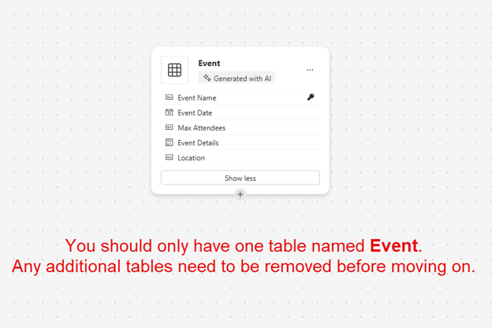

---
lab:
  title: 'ラボ 2:データ モデルを作成する'
  learning path: 'Learning Path: Manage the Microsoft Power Platform environment'
  module: 'Module 1: Describe Microsoft Dataverse'
---

## 学習の目的

この演習では、学習者は Copilot を使用してデータ モデルを構築します。 構築するテーブルの種類の説明を指定し、デザイナーを使用して、必要に応じて列を追加するなどの変更を加えます。

このラボを完了すると、次のことができるようになります。

- Copilot を使用してデータ モデルの作成を支援します。
- テーブルに列を追加および編集します。

### シナリオ

Contoso Consulting は、IT および AI コンサルティング サービスに特化したプロフェッショナル サービス組織です。 彼らは一年を通じて顧客にさまざまなイベントを提供しています。 これらのイベントの中には、多くのパートナーが参加して新製品、市場動向、サービスに関する詳細情報を提供する展示会形式のイベントもあります。 その他、年間を通じて、個々の製品に関する詳細情報を提供する短いウェビナーも開催されています。

Contoso は、Power Platform を使用して、年間を通じて開催するさまざまなイベントを管理するために使用できるイベント管理ソリューションを構築したいと考えています。 さらに、Contoso では従業員機器チェックアウト プログラムをサポートするアプリケーションの構築を検討しています。 

この演習では、Contoso がイベントを効果的に管理するために必要なさまざまな種類のイベント、イベント登録、その他のデータを格納するために使用されるデータ モードを作成します。 また、他のアプリケーションで使用される Equipment テーブルも作成します。  

### ラボの詳細

この演習を始める前に、以下を完了しておくことをお勧めします。

- **ラボ 1 - ソリューションを作成する**

> **重要:** このラボでは AI を使用してコンポーネントを構築します。 AI の結果は異なる可能性があるため、結果がラボで定義されたものと異なる (ただし似ている) 場合があることに注意してください。 ラボで概説されている基本的な概念は、何が作成されたか、またはどのような名前が付けられたかに関係なく同じです。 テーブルと列が完全と一致しない場合は、作成された内容に合わせて調整する必要がある場合があります。

### ラボのタイミング

この演習の推定所要時間は **30 から 45** 分です。

> **注:**  前のラボでは、イベント管理ソリューションを作成し、それをこの環境の優先ソリューションとして設定しました。 そのため、データ モデルを作成するためにソリューションに直接移動する必要はありません。 作成した項目は自動的にソリューションに追加されます。

> **注:**  Copilot を使用して任意の列を作成するときに、テーブルに **[要注意]** のエラー メッセージが表示された場合は、次のステップに従って列を手動で作成できます。
> 1. **[表示オプション]** を選択し、**[データの表示]** を選択します。 テーブルの構造が表示されます。
> 1. **[+ 新しい列]** をクリックして新しい列を追加します。

## タスク 1:データ モデルを作成する

Contoso は現在、寄付者の連絡先情報を Dataverse インスタンスに格納しています。 彼らは、Dataverse を使用して、申請する補助金や受け取った寄付を追跡したいと考えています。 Contoso の将来のアプリケーション ニーズをサポートするために必要なテーブルを作成する必要があります。

1.  必要に応じて、Web ブラウザーを開いて [Power Apps](https://make.powerapps.com/) Maker Portal に移動し、Microsoft アカウントの資格情報を使用してサインインします。
1.  Power Apps のホーム画面で、左側のナビゲーションを使用して **[テーブル]** を選択します。
1.  **[テーブル]** で、**[Copilot の使用を開始する]** を選択します。
1.  **[Copilot で構築するテーブルについて説明する]** 画面で、次のように入力します。「イベントを管理するためのテーブルを作成してください。** テーブルは、イベントの名前、イベント データ、場所、出席者の最大数、およびイベントの詳細を識別する必要があります。」
1.  **[生成]** ボタンの横にある **[テーブル設定]** を選択し、次のように構成します。
    - **テーブル オプション:** 1 つのテーブル
    - リレーションシップを**含めない**でください。

    

1.  **[生成]** ボタンを選択します。

    > **重要:** Copilot により、**Events** というテーブルが **1 つ**だけ作成されるはずです。 それより多く作成された場合は、削除するテーブルの名前を Copilot に指定して、それらを **DELETE** する必要があります。 **余分なテーブルを削除しないと、次の手順に影響します。**

    

**Copilot でデータ モデルを編集する**

テーブルを作成したので、次にテーブルにいくつかの列を追加します。 まず、イベントの種類を表す列を追加します。 また、イベントには連絡先を付け加える予定です。 既存の Contact テーブルをデータ モデルに追加し、後でイベント登録に関連付けます。

7.  **[次は何をしますか]** フィールドに次のように入力します: *`Add a choice column named Event Type to Event table.`*
1.  次のテキストを入力して、別の列を追加します: *`Add a choice column named Registration Required to Event table.`*

    

    > **重要:** イベント テーブルは上記の画像と完全と一致する必要はありませんが、少なくとも次の列が含まれている必要があります。
    - Event Name
    - イベントの日付
    - Max Attendees
    - Location
    - イベントの種類
    - Registration Required。

    上記のすべての列がない場合は、Copilot を使用してデータ モデルに追加します。  

    次に、**Contact** テーブルをデータ モデルに追加します。

1.  上部の**コマンド バー**で、**[+ 既存のテーブル]** を選択します。
1.  **[検索]** フィールドに「**Contact**」と入力し、**[選択した項目を追加]** を選択します。

    イベントの種類によっては、1 つ以上のセッションが存在する場合があります。 さまざまなセッションを管理するには、セッションとは何か、およびそれが関連付けられているイベントを定義する必要があります。 次に、Copilot を使用してイベント セッション テーブルを作成します。

1.  **[次は何をしますか]** フィールドに次のように入力します: *`Add a new table called Event Session. `*

    Copilot はおそらく、Event Session と Event Speaker の 2 つのテーブルを作成します。 Contacts は話者となるため、Event Speaker テーブルは削除します。

1.  必要に応じて、**[次は何をしますか]** フィールドに次のように入力します: *`Remove the Event Speaker table.`*
1.  **[次に何をしますか?]** で、次のテキストを入力します: *`Add a new text column to the Event Session table called Session Description.`*

    

    次に、**Session Registrations** という最後のテーブルを 1 つ追加します。 このテーブルは、特定のセッションに登録する個人を管理するために使用されます。

1.  **[次に何をしますか?]** で、次のテキストを入力します: *`Add a new table called Session Registrations.`*

    Copilot はおそらく、Session Registration、Session または Participant (または他の何か) などの 2 つのテーブルを作成します。 Contacts は参加者になることができるため、Participant テーブルを削除します。 Session Registration 以外の他のテーブル (Session など) が作成されている場合は、それらを削除します。

1.  必要に応じて、**[次に何をしますか?]** で、次のテキストを入力します: *`Remove the Participant table.`*
    
    場合によっては、セッション登録テーブルに Participant Name 列が追加されることがあります。 後でデータ モデルを保存するときに問題が発生する可能性があるため、これを削除する必要があります。 (後で別の参加者列に置き換える予定です。)  

1.  必要に応じて、**[次に何をしますか?]** で、次のテキストを入力します: *`Remove the Participant Name column from the Session Registration table.`*

1.  Primary Column フィールドがある場合は、次のテキストを入力します: *`Rename the Primary Column to Registration Name in Session Registration table.`*

1.  **[次に何をしますか?]** で、次のテキストを入力します: *`Add a text column to the Session registration table called Special Instructions.`*

    完成したセッション登録テーブルは、次の画像のようになります。

    

    > **重要** 完全に一致する必要はありませんが、Participant という名前の列がないことと、少なくとも次の列が含まれていることが重要です。
    - Registration Name
    - Session Date
    - 特別な指示

    次に、異なるテーブル間のリレーションシップを作成します。 Contact レコードはセッションの話者になる可能性があるため、Contact および Event Session テーブルの間にリレーションシップを作成します。

1.  コマンド バーで、**[リレーションシップの作成]** を選択します。
1.  関連付けを次のように構成します。
    - **リレーションシップの種類:** 一対多
    - **1:** 連絡先
    - **多:** Event Session
    - **表示名**: `Speaker`
1.  **完了** を選択します。

    

    セッション内で連絡先をセッションに登録できるため、Contact および Session Registration テーブルの間にリレーションシップを作成します。

1.  **コマンド バー**で、**[リレーションシップの作成]** を選択します。
1.  関連付けを次のように構成します。
    - **リレーションシップの種類:** 一対多
    - **1:** 連絡先
    - **多:** Session Registration
    - **表示名**: `Participant`

    

1.  **完了** を選択します。

    1 つのイベントには複数のセッションが関連付けられる可能性があるため、Event と Event Session テーブルの間にリレーションシップを作成します。

1.  **コマンド バー**で、**[リレーションシップの作成]** を選択します。
1.  関連付けを次のように構成します。
    - **リレーションシップの種類:** 一対多
    - **1:** イベント
    - **多:** Event Session
    - **表示名**: `Event`

    

1. **完了** を選択します。

    最後に、Participants は Event Sessions に登録するので、Event Sessions と Event Registrations テーブルの間にリレーションシップを作成する必要があります。

1.  **コマンド バー**で、**[リレーションシップの作成]** を選択します。
1.  関連付けを次のように構成します。
    - **リレーションシップの種類:** 一対多
    - **1:** Event Session
    - **多:** Session Registrations
    - **表示名**: `Event Session`

    

1.  **完了** を選択します。

    新しく作成されたデータ モデルは次の画像のようになります。

    

1.  **[保存して終了]** を選択します。

## タスク 2:テーブルと列を直接編集する

Copilot は、テーブルと列を非常にすばやく作成できるすばらしい方法です。 ただし、テーブルと列を直接変更する必要がある場合もあります。 たとえば、このタスクでは、既存の列をいくつか更新し、特定のセッションに登録されている参加者の数を追跡します。

1.  必要に応じて、Web ブラウザーを開いて [Power Apps](https://make.powerapps.com/) Maker Portal に移動し、Microsoft アカウントの資格情報を使用してサインインします。
1.  左側のナビゲーションを使って、**[テーブル]** を選択します。
1.  **[検索]** フィールドに「**Event**」と入力します。
1.  **Event** テーブルを開きます。
1.  **[スキーマ]** 見出しの **[列]** を選択します。
1.  **Event Type** 列を見つけて開きます。
1.  ラベルを次のものに置き換えます。
    - 会議
    - 見本市
    - ウェビナー
    - 昼食および学習
    - リリース
1.  **[既定の選択肢]** を **[なし]** に設定します。

    

1.  **[保存]** ボタンを選択します。 (初回で、列の保存が失敗する場合は、もう一度試してください。)**

    次に、セッション登録の合計数を追跡するために、**Event Session** テーブルに新しい列を追加します。

1.  左側のナビゲーションを使用して **[テーブル]** を選択し、**Event** テーブルから移動します。
1.  **[検索]** フィールドに「**Event**」と入力します。
1.  **Event Session** テーブルを開きます。
1.  **[スキーマ]** 見出しの **[列]** を選択します。
1.  コマンド バーで、**[新しい列]** ボタンを選択します。
1.  新しい列を次のように構成します。
    - **表示名**: `Total Registrations`
    - **データ型**:整数
    - **動作**:ロールアップ

    

1.  **保存と編集**を選択します。

    > **重要:** ポップアップ ブロックを有効にしているときは、ロールアップ フィールドを表示するために、ポップアップ ブロックを無効にする必要がある場合があります。

1.  ロールアップ列を次のように構成します。
    - **[関連エンティティ]** で、**[関連エンティティの追加]** を選択します。
    - **Session Registration** テーブルを選択します。
    - **[変更を保存]** ボタン ("チェック マーク") を選択します**
    - **[集計]** で、**[集計の追加]** を選択します。
    - **[集計関数]** で、**[Count]** を選択します。
    - **[集計された関連エンティティ]** フィールドで、**Session Registration** を選択します。
    - **[変更を保存]** ボタン ("チェック マーク") を選択します**

    

1.  **[保存して閉じる]** ボタンを選択します。

    これで、イベント管理アプリケーションをサポートするために使用されるデータ モデルが正常に作成されました。 

## タスク 3:機器テーブルを作成する

Contoso では、イベントの管理に加えて、従業員のチェックアウト プログラムも運用しています。  次に、機器を格納するテーブルを作成します。 
1.  左側のナビゲーションを使って、**[テーブル]** を選択します。
1.  **[テーブル]** で、**[Copilot の使用を開始する]** を選択します。
1.  **[Copilot で構築するテーブルについて説明する]** 画面で、次のように入力します: *`Create a table for checking out equipment. The table should include the Equipment Name, Due Date, and Item number.`*
1.  **[生成]** ボタンの横にある **[テーブル設定]** を選択し、次のように構成します。
    - **テーブル オプション:** 1 つのテーブル
    - リレーションシップを**含めない**でください。

    

1. **[生成]** ボタンを選択します。

    > **重要:** Copilot により、**Checkout Equipment** というテーブルが 1 つだけ作成されるはずです。 それよりも多く作成された場合は、削除するテーブルの名前を Copilot に伝えて削除することができます。

**Copilot でデータ モデルを編集する**

テーブルを作成したので、次にテーブルにいくつかの列を追加します。 まず、イベントの種類を表す列を追加します。 また、イベントには連絡先を付け加える予定です。 既存の Contact テーブルをデータ モデルに追加し、後でイベント登録に関連付けます。

6.  **[次は何をしますか]** フィールドに次のように入力します: *`Rename the table to Equipment.`*
1.  **[次は何をしますか]** フィールドに次のように入力します: *`Add a choice column named Equipment type.`*
1.  次のテキストを入力して、別の列を追加します: *`Add a text column named Category.`*
1.  次のテキストを入力して、別の列を追加します: *`Add a text column named Status.`*

    完成したテーブルは次の画像のようになります。

    

1.  テーブルに余分な列がある場合は、「*`Delete the [column name] column.`*」と入力して、それらの列を削除します
1.  テーブルが画像と一致したら、**[保存して終了]** を選択します。

## タスク 4:Equipment テーブルを直接変更する

1.  必要に応じて、Web ブラウザーを開いて Power Apps Maker Portal に移動し、Microsoft アカウントの資格情報を使用してサインインします。
1.  左側のナビゲーションを使って、**[テーブル]** を選択します。
1.  **[検索]** フィールドに「**Equipment**」と入力します。
1.  **Equipment** テーブルを開きます。
1.  **[スキーマ]** 見出しの **[列]** を選択します。
1.  **Equipment Type** 列を見つけて開きます。
1.  必要に応じて、ラベルを次のように置き換えます。
    - 電子
    - 家具
    - ツール
    - アクセサリ
1.  **[既定の選択肢]** を **[なし]** に設定します。

    

1.  [保存] ボタンを選択します。 (初回で、列の保存が失敗する場合は、もう一度試してください。)

これで、Microsoft Dataverse でデータ モデルが正常に作成されました。

