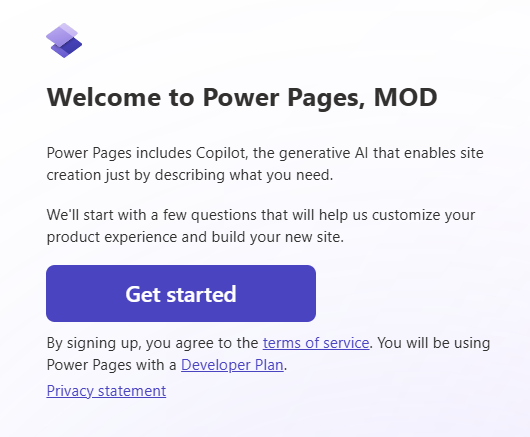
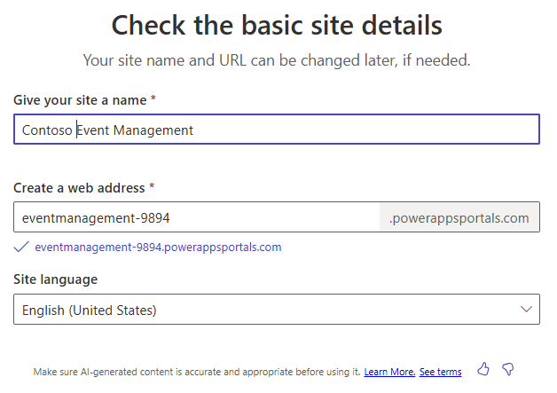

---
lab:
  title: '課題 3:Power Pages サイトを作成する'
  learning path: 'Learning Path: Demonstrate the capabilities of Microsoft Power Pages'
  module: 'Module 2: Create a Microsoft Power Pages site'
---
## 学習の目的

この演習では、学習者は Copilot を使用して Power Pages サイトを構築します。 サイトを作成したら、Power Pages デザイン スタジオを使用して、コンテンツの追加や変更、テーマの変更などのタスクを実行します。

### シナリオ

Contoso Consulting は、年間を通じてさまざまなイベントを主催しています。 対面イベント、ウェビナー、講師主導のトレーニングなど多岐にわたります。 開催するさまざまなイベントを管理するために Microsoft Power Platform を使用することを検討しています。 Power Pages を使用して、主催するさまざまなイベントを表示するイベント管理サイトを作成したいと考えています。

この演習を完了すると、次のことができるようになります。

-   Copilot を使用してイベント管理 Web サイトを構築する。
-   サイトに新しいコンテンツを追加する。
-   さまざまなデバイスで新しい Power Pages サイトをプレビューする。

**ラボの詳細:**

この演習を始める前に、次のラボを完了しておく必要があります。

- **ラボ 2 - データ モデルを作成する**

> **重要:** このラボでは AI を使用してコンポーネントを構築します。 AI の結果にはばらつきがあるため、ラボで定義したものと異なる (ただし似ている) 結果になる可能性があることに注意してください。 ラボで概説されている基本的な概念は、何が作成されたか、またはどのような名前が付けられたかに関係なく同じです。 テーブルと列が完全と一致しない場合は、作成された内容に合わせて調整する必要がある場合があります。

この演習の推定所要時間は **30 から 45** 分です。

**作業を開始する準備:** Power Pages Maker Portal に初めてアクセスする場合は、状況に応じていくつか設定する必要があります。  その場合は、次の手順を実行します。  それ以外の場合は、「**タスク 1**」に進みます。  

1.  必要に応じて、[Microsoft Power Pages](https://make.powerpages.microsoft.com) に移動します。
2.  **[Power Pages へようこそ]** 画面で、**[開始]** ボタンを選択します。

3. **[あなたのことを少し教えてください]** 画面で **[スキップ]** ボタンを選択します。

## タスク 1:Copilot を使用して新しい Power Pages サイトを作成する。

1.  必要に応じて <https://make.powerpages.microsoft.com> に移動します
2.  **Power Pages デザイン スタジオ**のホーム ページで、次のテキストを入力します。「私たちの組織が主催するイベントを管理するサイトを構築してください。」**
3.  **[送信]** ボタンを選択します。
4.  **[サイトの基本的な詳細の確認]** 画面で、次のように構成します。
    - **サイトに名前を付ける:** Contoso Event Management
    - **Web アドレスの作成:** 表示された既定のアドレスを受け入れます
    - **サイトの言語:** 英語

5.  **[次へ]** ボタンを選択します。
6.  **[レイアウトの選択]** 画面で、提案されたレイアウトを確認します。 その他のレイアウト提案が必要な場合は、**[もう一度試す]** を選択して、**Copilot** に別のレイアウトを提案してもらいます。
7.  使用するテンプレートを決定したら、**[次へ]** を選択します。
8.  **[共通ページの追加]** セクションで、次のページを選択します。
    - 会社紹介
    - お問い合わせ
    - よく寄せられる質問
    - 必要に応じてその他のページを選択します。
9.  ページを選択したら、**[完了]** を選択します。

新しいサイトがバックグラウンドで作成されます。数分かかる場合があります。

10.  サイトが作成されたら、開きます (まだ開いていない場合)。

> **注:**  サイトを初めて読み込むときに、"Liquid オブジェクトが見つかりません" というメッセージが表示される場合があります。 このような場合は、ブラウザー ウィンドウを更新して (F5 キー) サイトを再度読み込みます。 サイトが表示されます。

## タスク 2:サイトのコンテンツを変更する

最初のサイトが作成されたので、デザイン スタジオを使用し、ページ、テキスト、画像、フォームなどを追加してサイトを変更できます。

1.  **[メイン ナビゲーション]** で、**[ホーム]** を選択して **[ホーム]** ページを開きます。
2.  サイト ヘッダーの **[Contoso Event management Site]** テキストにカーソルを合わせ、**[サイト ヘッダーの編集]** を選択します。
3.  **[サイト タイトル]** を「**Contoso Consulting**」に変更します。
4.  **[画像のアップロード]** ボタンを選択します。
5.  **[画像の追加]** 画面で **[画像のアップロード]** を選択し、クラス ファイルから **Contoso ロゴ**を選択して、**[開く]** を選択します。
6.  **Contoso ロゴ**画像を選択した状態で、**[OK]** を選択します。
7.  変更が完了したら、**[X]** を選択して **[サイト ヘッダーの編集]** 画面を完了します。
8.  サイトの背景画像を変更するには、背景画像の任意の場所をクリックします。
9.  表示されるメニューから、**[背景の編集]** を選択します。
10. **[画像の変更]** ボタンを選択します。
11. **[メディア ライブラリ]** を選択し、**[画像のアップロード]** を選択します。
12. クラス ファイルから **Site_Background** 画像を選択し、**[開く]** を選択します。
13. Site_Background を選択した状態で、**[OK]** を選択します。
14. テキスト "**Welcome to Contoso Events**" を選択し、「**Contoso Consulting**」に変更します。
15. 表示されるツール バーで、**[デザイン]** ("ペイント ブラシ") ボタンを選択します。**
16. **[文字の影]** プロパティの横にある矢印を選択し、**[H オフセット]** を「**2**」に設定します。
17. **[X]** を選択して **[テキストのデザイン]** ウィンドウを閉じます。
18. Contoso Consulting の下のテキスト "*(Might say something similar to Your Partner in Event Management)*" を選択し、「**Your partner for today and tomorrow**」に変更します。

ホーム ページに基本的な変更をいくつか加えたので、Contoso のブランドに合わせてサイトのテーマを更新します。

19.  左側のナビゲーションを使用して、**[スタイル指定]** ボタンを選択します。
20.  **[明るい青]** テーマを選択します。
21.  **[ブランド カラー]** で **[灰色]** の色の円を選択します。
22.  **[16 進数]** の色を変更します **: 101E2B**
23.  **[OK]** を選択します。
24.  **[白]** の円を選択し、色を **[16 進数]** コードの **e8e8e8** に変更します。
25.  **[OK]** を選択します。
26.  **[黒]** の円を選択し、色を **[白]** に変更します。 (ffffff)
27.  **[OK]** を選択します。
28. 必要に応じて、その他のテーマの変更を行います。 テーマの変更が完了したら、**[保存]** ボタンを選択します。

## タスク 3:サイトをビジネス データに接続する

Power Pages の主な利点の 1 つは、Power Pages を Dataverse にあるビジネス データに接続できることです。 データを取り込む前に、使用する要素をいくつか構築する必要があります。

1.  左側のナビゲーションを使用して、**[データ]** アイコンを選択します。
2.  **[検索]** フィールドに「**Event**」と入力します。
3.  **[イベント]** テーブルを選択します。

まず、新しいイベントを追加するときに使用するフォームを作成します。

4.  **[フォーム]** タブを選択し、**[新しいフォーム]** を選択します。
5.  **[フォーム名]** を「**Create Event**」に設定し、**[作成]** ボタンを選択します。
6.  ここでは、レイアウトを変更しません。 **保存して公開**ボタンを選択します。
7.  **戻る矢印**を押してデザイナーに戻ります。

次に、既存のイベントの表示と編集に使用するフォームを作成します

8.  **[新しいフォーム]** ボタンを選択します。
9.  フォームに「**View Event**」と名前を付け、**[作成]** ボタンを選択します。
10.  **コマンド バー**の **[コンポーネントの追加]** を選択し、**[サブグリッド]** を選択します。
11.  [サブグリッド] を次のように構成します。
    -   **関連レコードの表示:** はい
    -   **テーブル:** イベント セッション
    -   **既定値:** Active sessions
12.  **完了** を選択します。
13.  **保存して公開**ボタンを選択します。
14.  **[戻る]** ボタンをクリックして**デザイン スタジオ**に戻ります。

## タスク 4:必要な Web ページ フォームを作成する

イベント テーブルのフォームを定義したので、サイト ユーザーがイベント レコードを操作できるように、それらのフォームを含むページを作成します。 イベントを表示、作成、編集するためのページを作成します。

1.  左側のナビゲーションを使用して、**[ページ]** アイコンを選択します。
2.  **[+ ページ]** ボタンを選択します。
3.  **Copilot** に、次のテキストを入力します。「新しい空白ページを追加してください。」** **[送信]** ボタンを選択します。
4.  **[保持する]** ボタンを選択します。
5.  新しいページの上部にある **[セクションの追加]** ボタンを選択します。
6.  **[1 列]** を選択します。
7.  **[このセクションに追加するコンポーネントを選択してください]** で **[フォーム]** を選択します。
8.  **+ 新しいフォーム**を選択します。
9.  **[フォームの追加]** 画面で、次のように構成します。
    - **テーブルの選択:** イベント
    - **フォームの選択:** Create Event
    - **選択したフォームのコピーに名前を付ける:** Create Event
10. **[データ]** タブを選択し、**[このフォームのデータ]** が **[新しいレコードの作成]** に設定されていることを確認します。
11. **[送信時]** タブを選択します。**[このメッセージを表示する]** フィールドに「*Your event has been successfully submitted*」と入力します。
12. **[OK]** ボタンを選択します。

ページ上のその他のセクションは必要ないので削除しましょう。

13. 追加した **[フォーム]** の下の **[セクション]** を選択します。 表示されるツール バーで、[その他] **(…)** を選択し、**[削除]** を選択します。
14. 前の手順を繰り返して、ページから残り 2 つのセクションを削除します。

完了すると、作成したフォームとページの下部にあるフッターのみが残ります。

15. 左側の **[メイン ナビゲーション]** で、作成した **[新しいページ]** の横にある [省略記号] を選択します。
16. 表示されるメニューから、**[ページの設定]** を選択します。
17. ページの設定を次のように構成します。
    - **名前:** New Event
    - **部分的な URL:** New-Events
18. **[OK]** ボタンを選択します。

次に、個々のイベントを表示するために使用できるページを追加します。

19.  **[ページ]** が選択されていることを確認して、**[+ ページ]** ボタンをクリックします。
20.  **[作成するページの説明]** 画面で、次のように入力します。「"View Event" という空白ページを追加してください。」** **[送信]** ボタンを選択します。
21.  **[保持する]** ボタンを選択して、新しいページを受け入れます。
22.  新しいページの上部にある **[セクションの追加]** ボタンを選択します。
23.  **[1 列]** を選択します。
24.  **[このセクションに追加するコンポーネントを選択してください]** で **[フォーム]** を選択します。
25.  **+ 新しいフォーム**を選択します。
26.  **[フォームの追加]** 画面で、次のように構成します。
    - **テーブルの選択:** イベント
    - **フォームの選択:** View Event
    - **選択したフォームのコピーに名前を付ける:** View Event
27.  **[データ]** タブを選択し、**[このフォームのデータ]** フィールドを **[読み取り専用]** に設定します。
28. **[OK]** ボタンを選択します。

ページ上のその他のセクションは必要ないので削除しましょう。

29. 追加した **[フォーム]** の下の **[セクション]** を選択します。 表示されるツール バーで、[その他] **(…)** を選択し、**[削除]** を選択します。
30. 前の手順を繰り返して、ページから残りのセクションを削除します。
31. 左側の **[メイン ナビゲーション]** で、作成した新しいページの横にある **[省略記号]** を選択します。
32. 表示されるメニューから、**[ページの設定]** を選択します。
33. ページの設定を次のように構成します。
    - **名前:** View Event
    - **部分的な URL:** View-Events
34. **[OK]** ボタンを選択します。

最後に、イベントを編集するために使用する Web ページ フォームをもう 1 つ作成しましょう。

35.  **[ページ]** が選択されていることを確認して、**[+ ページ]** ボタンをクリックします。
36.  **[作成するページの説明]** 画面で、次のように入力します。「"Edit Event" という空白ページを追加してください。」** **[送信]** ボタンを選択します。
37.  **[保持する]** ボタンを選択して、新しいページを受け入れます。
38.  新しいページの上部にある **[セクションの追加]** ボタンを選択します。
39.  **[1 列]** を選択します。
40.  **[このセクションに追加するコンポーネントを選択してください]** で **[フォーム]** を選択します。
41.  **+ 新しいフォーム**を選択します。
42.  **[フォームの追加]** 画面で、次のように構成します。
    - **テーブルの選択:** イベント
    - **フォームの選択:** Create Event
    - **選択したフォームのコピーに名前を付ける:** Edit Event
43.  **[データ]** タブを選択し、**[このフォームのデータ]** を **[既存のレコードを更新する]** に設定します。
44. **[OK]** ボタンを選択します。

ページ上のその他のセクションは必要ないので削除しましょう。

45. 追加した **[フォーム]** の下の **[セクション]** を選択します。 表示されるツール バーで、[その他] **(…)** を選択し、**[削除]** を選択します。
46. 前の手順を繰り返して、ページから残りのセクションを削除します。
47. **[OK]** ボタンを選択します。

## タスク 5:イベント一覧を表示するページを作成する

レコードの管理に使用する必要なフォームを定義したので、次はそれらのレコードを表示するページ ビューを作成します。

1.  **[+ 新しいページ]** ボタンを選択します。
2.  **[作成するページの説明]** 画面で、次のように入力します。「"events" という空白のページを追加してください。」** **[送信]** ボタンを選択します。
3.  **[保持する]** を選択して、新しいページを受け入れます。
4.  新しいページの上部にある **[セクションの追加]** ボタンを選択します。
5.  **[1 列]** を選択します。
6.  **[このセクションに追加するコンポーネントを選択してください]** で **[フォーム]** を選択します。
7.  **[その他]** ボタン ("…") を選択します。** **[接続されたデータ]** グループで、**[リスト]** を選択します。
8.  **[リストの追加]** 画面で **[設定]** タブを選択し、次のように設定します。
    - **テーブルの選択:** イベント
    - **データ ビューの選択:** Active Events、Inactive Events
    - **リストに名前を付ける:** イベント
9.  **[アクション]** タブを選択し、次のように構成します。
    - **新しいレコードの作成:** オン
        - **ターゲットの種類:** フォーム
        - **フォーム:** Create Event
        - **表示ラベル:** Create New Event
    - **詳細の表示:** オン
        - **ターゲットの種類:** フォーム
        - **フォーム:** View Event
        - **表示ラベル:** See Event Details
    - **レコードの編集:** オン
        - **ターゲットの種類:** フォーム
        - **フォーム:** Edit Event
        - **表示ラベル:** Edit Event
9. **完了** を選択します。

## タスク 6:アクセス許可を更新する

ユーザーが自分に関連するデータのみを表示できるように、組織はテーブルのアクセス許可を指定できます。 このタスクでは、誰にでもアクセスを許可する非常に基本的なアクセス許可を作成します。

1.  **[メイン ナビゲーション]** で **[Events]** ページを選択します。
2.  **[Events]** リストを選択し、**[+ 新しいアクセス許可]** ボタンをクリックします。
3.  次のようにアクセス許可を構成します。
    -   **名前:** イベント
    -   **テーブル:** イベント
    -   **アクセスの種類:** グローバル アクセス
4.  **[アクセス許可]** を **[読み取り]** に設定します。
5.  **[ロールの追加]** を選択し、**[管理者]**、**[匿名ユーザー]**、**[認証済みユーザー]** のロールを選択します。
6.  **[保存]** ボタンを選択します。
7.  **[データは誰でも閲覧できます]** という画面が表示されるので、**[保存]** を選択します。

イベント フォーム ページでもこのプロセスを繰り返しましょう。 まずは **[New Event]** ページから始めましょう

8.  **[メイン ナビゲーション]** で、**[New Event]** ページを選択します。
9.  **[アクセス許可の更新]** ボタンを選択します。
10.  次のようにアクセス許可を構成します。
    -   **名前:** Create Events
    -   **テーブル:** イベント
    -   **アクセスの種類:** グローバル アクセス
11.  **[アクセス許可]** を **[読み取り]** と **[作成]** に設定します。
12.  **[ロールの追加]** を選択し、**[管理者]**、**[匿名ユーザー]**、**[認証済みユーザー]** のロールを選択します。
13.  **[保存]** ボタンを選択し、ポップアップ画面で **[保存]** をもう一度選択します。

次に、**[Edit Event]** 画面を設定します。

14.  **[メイン ナビゲーション]** で、**[Edit Event]** ページを選択します。
15.  **[アクセス許可の更新]** ボタンを選択します。
16.  次のようにアクセス許可を構成します。
    -   **名前:** Create Events
    -   **テーブル:** イベント
    -   **アクセスの種類:** グローバル アクセス
17.  **[アクセス許可]** を **[読み取り]** と **[更新]** に設定します。
18.  **[ロールの追加]** を選択し、**[管理者]**、**[匿名ユーザー]**、**[認証済みユーザー]** のロールを選択します。
19.  **[保存]** ボタンを選択し、ポップアップ画面で **[保存]** をもう一度選択します。

## タスク 7:サイト ナビゲーションを更新する

ページと項目の書式が想定どおりになったので、それに応じてサイト ナビゲーションを調整します。

1.  **[メイン ナビゲーション]** で、**[Event]** ページの横にある **[省略記号]** を選択します。
2.  表示されるメニューから、**[上へ移動]** を選択します。
3.  **[Event]** ページが **[Contact Us]** ページの下に表示されるまで手順を繰り返します。
4.  **[New Event]** ページが **[Events]** ページの直下にあることを確認します。 (そうでない場合は、[New Event] ページをその位置に移動します。)**
5.  **[New Event]** ページで、**[省略記号]** ボタンを選択します。
6.  表示されるメニューから、**[これをサブページにする]** を選択します。
7.  **[View Event]** の横にある [省略記号] を選択し、**[他のページに移動]** を選択します。
8.  **[Edit Event]** の横にある [省略記号] を選択し、**[他のページに移動]** を選択します。
9.  **コマンド バー**の **[同期]** ボタンを選択します。

## タスク 8:サイトをプレビューして調整する

サイトが作成されたら、サイトがビジネスのニーズと要件を満たしているかどうかを確認し、必要な改良点を判断できるようにすることをお勧めします。 サイトはデスクトップ モードとモバイル モードでプレビューできます

1.  デザイン スタジオで **[ホーム]** ページ ボタンを選択します。
2.  コマンド バーから **[プレビュー]** を選択します。
3.  **[デスクトップ]** を選択してブラウザーでサイトをプレビューします。
4.  **[デスクトップ]** モードで表示している場合は、サイトの次の点を確認します。
    -   レイアウトとナビゲーション。
    -   色、フォント、ロゴなどのブランド要素。
5.  サイトのテストが完了したら、**ブラウザー タブ**を閉じてサイト エディターに戻ります。

次に、モバイル デバイスに表示されるサイトをプレビューします。

6.  もう一度 **[プレビュー]** ボタンを選択します。
7.  表示された **QR コード**をモバイル デバイスでスキャンします。
8.  サイトはモバイル デバイスで開きます (注: ログインを求められる場合があります。その場合はログイン資格情報を入力します。)**
9.  [デスクトップ] モードのときと同様に、サイトの次の点を確認します。
    - レイアウトとナビゲーション。
    - 色、フォント、ロゴなどのブランド要素。
10. テストが完了したら、ブラウザー タブを閉じてサイトに戻ります。
