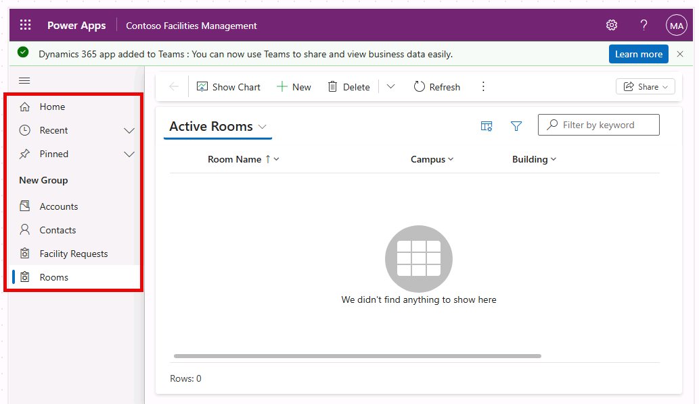
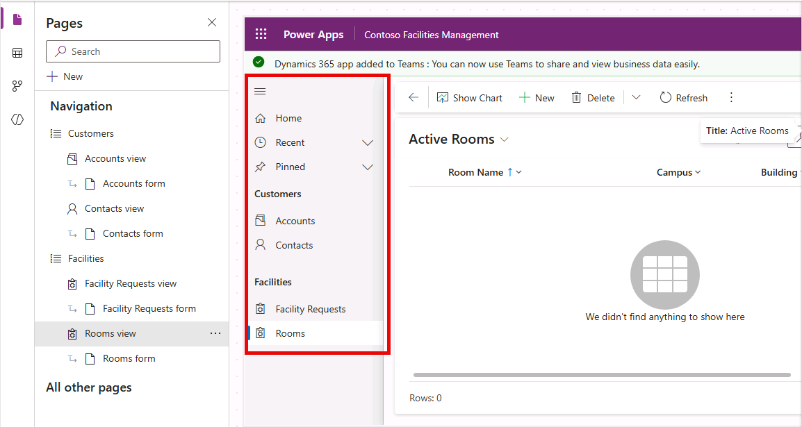

---
lab:
  title: '課題 3:モデル駆動型アプリを作成する'
  learning path: 'Learning Path: Demonstrate the capabilities of Microsoft Power Apps'
  module: Build a model-driven app
  description: このラボでは、最新のアプリ デザイナーを使って Power Apps でモデル駆動型アプリを作成します。 Dataverse テーブルをアプリに追加し、ナビゲーション グループを構成し、アプリケーションを発行してテストします。
  duration: 30 minutes
  level: 100
  islab: true
  primarytopics:
    - Power Apps
---
# 実習ラボ 3 - モデル駆動型アプリを作成する

**[推定時間]**: 30 分

## ラボの目的

このラボでは、次のことを学びます。

-   キャンバス アプリとモデル駆動型アプリの違いを理解する
-   最新のアプリ デザイナーを使ってモデル駆動型アプリを作成する
-   Dataverse テーブルをアプリのサイト マップに追加する
-   テーブルのメイン フォームとビューをカスタマイズする
-   モデル駆動型アプリを発行してテストする

## シナリオ

従業員はモバイル キャンバス アプリを使って要求を送信しますが、Contoso の施設管理チームには、すべての要求を管理、トリアージ、追跡するためのフル機能のデスクトップ アプリケーションが必要です。 モデル駆動型アプリは、インターフェイスがデータ モデルから自動的に生成され、一貫性のあるプロフェッショナルなエクスペリエンスを提供するため、これに最適です。

# 演習 1: モデル駆動型アプリを作成する

## タスク 1:モデル駆動型アプリを作成する

1.  Power Apps Maker Portal `https://make.powerapps.com` に移動してサインインします。
1.  左側のナビゲーションから **[+ 作成]** を選んで、**[ナビゲーションを含む空白のページ]** を選びます。
1.  アプリに "**Contoso Facilities Management**" という名前を付けて、**[作成]** をクリックします。
1.  最新のアプリ デザイナーが開きます。

## タスク 2: Facility Request テーブルを追加する

1.  **アプリ デザイナー**で、**[+ ページの追加]** または **[+ 新規]** を選択して、**[Dataverse テーブル]** を選択します。
1.  **[施設要求]** と **[ルーム]** テーブルの両方を検索して選び (ラボ 1 を完了した場合)、さらに **[アカウント]** と **[連絡先]** テーブルを選択します。
1.  **[ナビゲーションに表示]** チェックボックスが選択されていることを確認して、**[追加]** を選択します。 テーブルがアプリのナビゲーションに表示されるようになります。

    

1.  **[ナビゲーション]** で **[新しいグループ]** を選びます。
1.  画面の右側で **[新しいグループ]** ペインを展開します。
1.  タイトルを **[新しいグループ]** から "**Customers**" に変更します。
1.  **Customers** グループの横にある **3 つのドット**を選んで、**[新しいグループ]** を選びます。
1.  **[新しいグループ]** の **[名前]** を "**Facilities**" に変更します。
1.  **[ナビゲーション]** で **Facility Requests** ビューを選び、**Facilities グループ**になるまで **[下に移動]** を選びます。
1.  **Rooms** ビューを選び、**Facility Requests** の下まで**移動**します。
1.  **[保存]** ボタンを選択します。
1.  完成したアプリは次の画像のようになるはずです。

    

# 演習 2: 施設要求フォームと施設要求の公開用ビューを編集する
## タスク 1: 施設要求のメイン フォームを変更する

1.  新しいタブを開き、Power Apps Maker Portal (`https://make.powerapps.com`) に移動します
1.  Dev One 環境にいることを確認します。
1.  左側のナビゲーション ウィンドウで、**テーブル**を選択します。 
1.  右上の検索バーに「**施設要求**」と入力し、結果から **[施設要求]** テーブルを選択します。
1.  **データ エクスペリエンス**で、**フォーム**を選択します。
1.  [フォームの種類] が [メイン] の **[情報]** フォームを選択し、[コマンド] メニュー (...) を選び、[編集] > [新しいタブで編集] の順に選択します。
1.  **[所有者]** 列を [ヘッダー] 領域にドラッグします。
1.  **[説明]** 列を **[要求のタイトル]** の下にドラッグします。
1.  **[要求した日]** 列を **[説明]** の下にドラッグします。
1.  **[推定コスト]** 列を **[要求した日]** の下にドラッグします。
1.  **[カテゴリ]** 列を **[推定コスト]** の下にドラッグします。
1.  **[優先順位]** 列を **[カテゴリ]** の下にドラッグします。
1.  **[状態]** 列を [ヘッダー] 領域にドラッグします。
1.  **保存と公開**を選択します。
1.  フォーム デザイナーを**閉じます**。
1.  **[完了]** を選択します

## タスク 2: 施設要求の公開用ビューを変更する

1.  Power Apps 作成者ポータル (`https://make.powerapps.com`) に移動します
1.  Dev One 環境にいることを確認します。
1.  左側のナビゲーション ウィンドウで、**テーブル**を選択します。 
1.  右上の検索バーに「**施設要求**」と入力し、結果から **[施設要求]** テーブルを選択します。
1.  **データ エクスペリエンス**で、**ビュー**を選択します。
1.  [アクティブな施設要求] ビューを選択し、[コマンド] メニュー (...) を選択し、[編集] > [新しいタブで編集] の順に選択します。
1.  **[作成日]** 列の横にあるキャレットを選び、**[削除]** を選択します。
1.  **[説明]** 列を選択してビューに追加します。
1.  **[要求した日]** 列を選択してビューに追加します。
1.  **[推定コスト]** 列を選択してビューに追加します。
1.  **[カテゴリ]** 列を選択してビューに追加します。
1.  **[優先順位]** 列を選択してビューに追加します。
1.  **[状態]** 列を選択してビューに追加します。
1.  **保存と公開**を選択します。
1.  ビュー デザイナーを**閉じます**。
1.  **[完了]** を選択します

## タスク 3: 発行してテストする

1.  Power Apps 作成者ポータル (`https://make.powerapps.com`) に移動します
1.  左側のナビゲーション ウィンドウで、**アプリ**を選択します。
1.  **[Contoso Facilities Management]** モデル駆動型アプリを選択し、[コマンド] メニュー (...) を選択して、[編集] を選択します。
1.  右上の **[保存して公開]** をクリックします。
1.  [再生] をクリックして、新しいブラウザー タブでアプリを開きます。
1.  次の点を確認します。
    -   ナビゲーション メニューに Facility Request テーブルが表示されます。
    -   テーブル名をクリックすると、構成した列を含むリスト ビューが表示されます。
    -   レコードをクリックすると、カスタマイズしたレイアウトを含むフォームが開きます。
    -   [+ 新規] をクリックすると、新しいレコードを作成できます。
****

