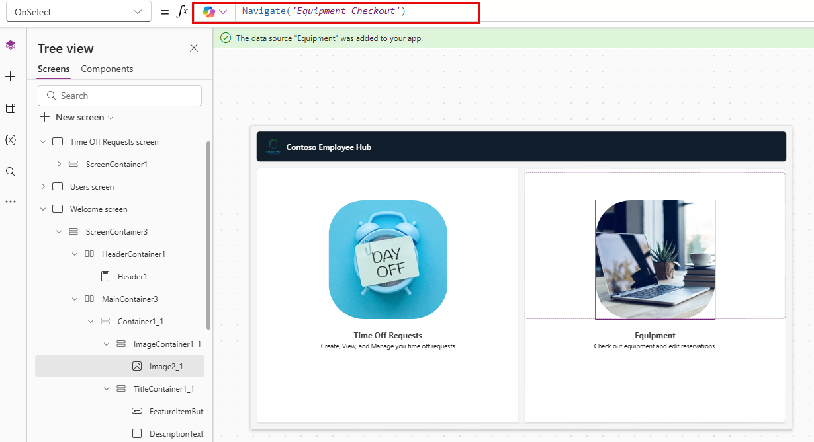

---
lab:
  title: 'ラボ 4:キャンバス アプリケーションを作成する'
  learning path: 'Learning Path: Demonstrate the capabilities of Microsoft Power Apps'
  module: 'Module 2: Build a canvas app'
---
## 学習の目的

この演習では、休暇の申請と管理、機器のチェックアウト申請に従業員が使用できるキャンバス アプリケーションを Copilot を使用して作成します。 このアプリを作成したら、Copilot と Power Apps デザイナーを使用してアプリを修正します。

このラボを完了すると、次のことができるようになります。

- Copilot を使用して、アプリをサポートするデータ モデルの作成について支援を受ける。
- キャンバス アプリケーションを変更する。

### シナリオ

Contoso Consulting は、IT および AI コンサルティング サービスに特化したプロフェッショナル サービス組織です。 従業員が休暇を申請するために使用できる休暇アプリケーションの作成を検討しています。

### ラボの詳細

この演習を始める前に、次のラボを完了しておく必要があります。

- **ラボ 2 - データ モデルを作成する**

> **重要**: このラボでは、AI を使用してコンポーネントを構築します。 AI の結果にはばらつきがあるため、ラボで定義したものと異なる (ただし似ている) 結果になる可能性があることに注意してください。 ラボで概説されている基本的な概念は、何が作成されたか、またはどのような名前が付けられたかに関係なく同じです。 テーブルと列が完全と一致しない場合は、作成された内容に合わせて調整する必要がある場合があります。*

この演習の推定所要時間は **60 から 75** 分です。

## タスク 1:Power Apps にサインインしてインターフェイスについて確認する

1.  Web ブラウザーを開き、[Power Apps](https://make.powerapps.com/) Maker Portal に移動します。
2.  左側のナビゲーションを使用して **[作成]** を選択します。
3.  **[アプリの作成]** で、**[Copilot で開始]** を選択します。
4.  **[Copilot で構築するテーブルについて説明する]** 画面で、次のように入力します。「従業員から送信された休暇申請を保存したいと考えています。 テーブルでは申請の開始時刻と終了時刻を特定できる必要があります。」
5.  **[テーブル オプション]** ボタンを選択します。 表示されるメニューから、**[1 つのテーブル]** を選択します。

6.  **[生成]** ボタンを選択します。

Copilot によって **Time Off Request** テーブルが作成されたはずです。 次に、テーブルに列を追加します。

7.  **[Copilot]** ペインで、次のように入力します。「"Time Off Reason" という選択肢の列を追加してください。」**
8.  **[Copilot]** ペインで、次のプロンプトを個別に追加します。
    - 「"Time off Type" という選択肢の列を追加してください。」**
    - 「"Submission Date" という日付列を追加してください。」**
    - 「Time Off request テーブルに "Approval Status" という選択肢の列を追加してください。」**
    - 「"Request Details" という複数行のテキスト列を追加してください。」**

    休暇テーブルは次の画像のようになります。

次に、休暇申請を特定のユーザーに関連付けることができるように、ユーザー テーブルをデータ モデルに追加します。

9.  **コマンド バー**で、**[+ 既存のテーブル]** を選択します。
10.  **[推奨]** から **[すべてのテーブル]** に切り替えます。
11.  **[検索]** フィールドに「**User**」と入力します。
12.  **User** テーブルを選択し、**[選択項目の追加]** ボタンをクリックします。
13.  **コマンド バー**で、**[リレーションシップの作成]** を選択します。
14.  関連付けを次のように構成します。

-   **1:** ユーザー
-   **多:** 休暇申請
-   **[表示名]:** Requesting Employee
  
15.  **完了** を選択します。

完成したデータ モデルは次の画像のようになります。

16.  **[アプリを保存して開く]** ボタンを選択します。

> [!NOTE]
> 新しいアプリが作成されるまでに数分かかる場合があります。

## タスク 2:新しいアプリをカスタマイズする

新しいアプリが作成されたら、ニーズに合わせていくつか変更を加えます。 まず、[ようこそ] 画面にいくつか変更を加えます。

1.  新しいアプリを開いたら、"**Time Off Requests**" テキストの上にある "**Image**" プレースホルダーを選択します。****
2.  表示されるメニューから、**[編集]**\>**[アップロード]** を選択します。
3.  クラス ファイル フォルダー内の **Time off** 画像を選択し、**[開く]** を選択します。
4.  次に、"**User**" の上にある "**Image**" プレースホルダーを選択します。
5.  表示されるメニューから、**[編集]**\>**[アップロード]** を選択します。
6.  クラス ファイル フォルダー内の **Employee** 画像を選択し、**[開く]** を選択します。

次に、ユーザーが読みやすくなるように画像のサイズを調整します。 さらに、各項目に表示されるテキストを調整します。

7.  **コマンド バー**の **[プロパティ]** ボタンを選択します。 (編集ボタンのすぐ右にあります。)**
8.  先ほど追加した **Time off** 画像を選択します。
9.  **[プロパティ]** パネルで、次のように画像を構成します。
    
    -   **画像の位置:** フィル
    -   **幅:** 300
    -   **高さ:** 300
      
11.  前の手順を繰り返して、**Employee** 画像の **[高さ]** と **[幅]** を **300** x **300** に設定します。
12.  以下のテキストを選択します: "**Time Off Requests**"。
13.  **[プロパティ]** パネルで **[テキスト]** フィールドを選択し、テキストを次のように変更します。「Create, View, and Manage you time off requests.」**
14.  **[ヘッダー]** の **[ようこそ画面]** のテキストを選択します。
15.  右側の **[プロパティ]** ペインで、**[ロゴ]** フィールドを選択します。
16.  表示されるメニューから、**[アップロード]** を選択します。
17. クラス ファイルから **Contoso ロゴ**を選択し、**[開く]** を選択します。
18. **[プロパティ]** パネルの **[スタイルとテーマ]** グループで **[塗りつぶし]** の色アイコンを選択します。
19. **[カスタム]** タブを選択します
20. **[16 進数]** の色を変更します: **101E2B**
21. **[ヘッダー]** を選択した状態で、**[タイトル]** を「**Contoso Employee Hub**」に変更します。
22. **コマンド** バーの **[保存]** ボタンを選択してアプリを保存します。
23. **[保存]** 画面で、**[名前]** を「**Contoso Employee Hub **」に設定し、**[保存]** を選択します。

アプリは画像のようになります。

## タスク 3:アプリに新しい画面を追加する。

アプリを構築しているときに、マネージャーの 1 人から、従業員もこのアプリを使用して機器をチェックアウトできるかどうかについて相談されました。 Contoso は既に Dataverse に機器のチェックアウト情報を保存しているので、その情報をアプリで使用できるようにするだけで済みます。

1.  アプリを開いたまま、**[Copilot]** ペインを展開します (必要な場合)。 Copilot で、次のように入力します。「"Equipment Checkout" という新しい画面を追加してください。」**
2.  **[Send]** を選択します。
3.  **[保持する]** ボタンを選択して、その画面を受け入れます。
4.  **[Equipment Checkout]** という新しい画面がアプリに追加されました。
5.  **[Equipment Checkout]** 画面で **[レイアウト付き]** をクリックし、**[サイドバー]** レイアウトを選択します。
6.  **SideBarContainer** が表示されるまで、複数のコンテナーを展開します。

7.  **SidebarContainer** を右クリックし、名前を **EquipContainer1** に変更します。
8.  **EquipContainer1** コンテナーを選択した状態で、**[挿入メニューを開く]** ボタンをクリックします。
9.  **[検索]** ウィンドウで「**ギャラリー**」と入力し、**[垂直ギャラリー]** を選択します。
10.  表示される **[検索]** フィールドにデータ ソースを入力するように求められたら、「**Equipments**」と入力し、**Equipment*s* テーブルを選択します。
11. 画面の左側にある**ツリー ビュー**で、先ほど追加した **Gallery1** コントロールを選択します。
12. ギャラリー名を右クリックし、**[名前の変更]** を選択して、名前を「**Equipment List**」に変更します。
13. **Equipment List** ギャラリーにカーソルを合わせ、ギャラリーの上に表示されるツール バーで **[レイアウト]** を選択します。
14. **[タイトルとサブタイトルのレイアウト]** オプションを選択します。
15. **Equipment List** ギャラリーを選択した状態で、**[プロパティ]** ペインで次のように構成します。

    -   **幅:** 360
    -   **高さ (伸縮可能):** オン
    -   **最小の高さ:** 287

次に、**EquipmentContiner1** コンテナーに、検索コントロールを格納するコンテナーを追加します。これは、**Equipment List** ギャラリーの内容をフィルター処理するために使用します。

16.  **ツリー** ビューで **EquipContainer1** を選択します。
17.  コンテナーにカーソルを合わせ、**Copilot** アイコンを選択します。
18.  次のテキストを入力します。「横型コンテナーを挿入してください。」**

19.  **[保持する]** ボタンを選択します。
20.  新しいコンテナーが **EquipContainer1** コンテナーの下部に追加されます。
21.  **ツリー ビュー**で、新しいコンテナーをクリックして長押ししたままドラッグし、**Equipment List** ギャラリーの上に配置します。
22.  コンテナーの名前を「**EquipSearchContainer**」に変更します。
23.  **EquipSearchContainer** を選択した状態で、**[プロパティ]** ペインで次のように構成します。
    
 -   **最小幅:** 0
 -   **高さ (伸縮可能):** オフ
 -   **高さ:** 44
   
24.  **EquipSearchContainer** を選択した状態で、**[挿入メニューを開く]** ボタンを選択します。
25. **[検索]** フィールドに「**テキスト**」と入力し、**[テキスト入力]** を選択します。
26. **[テキスト入力]** フィールドの名前を「**EquipSearchInput**」に変更します。
27. **EquipSearchInput** を選択した状態で、**[プロパティ]** ペインで次のように構成します。

    -   **既定値:** Blank (nothing)
    -   **ヒントのテキスト:** 検索
    -   **フォント:** Open Sans
    -   **フォント サイズ:** 14
    -   **パディング** (以下の値が既に設定されている可能性があります。)
        -   **上:** 5
        -   **下:** 5
        -   **左:** 12
        -   **右:** 5
    -   **高さ:** 44
    -   **幅 (伸縮可能):** オン
    -   **最小幅:** 0

        ![[検索条件] プロパティのスクリーンショット。](media/b0e092b4795edf58dad1153209639051.png)

28. **ツリー ビュー**で、**EquipSearchContainer ** を選択します。
29. コンテナーにカーソルを合わせ、**Copilot** アイコンを選択して、「検索アイコンを追加してください」と入力します。**
30. **[保持する]** を選択します。

> **注:**  Coplot によって挿入されたアイコンが間違っている場合は、削除して虫眼鏡を手動で挿入します。

31. **[検索]** アイコンを選択した状態で、**[プロパティ]** ペインでコントロールを次のように構成します。

    -   **パディング**
        -   **上:** 10
        -   **下:** 10
        -   **左:** 10
        -   **右:** 10
    -   **高さ:** 44
    -   **幅:** 44

![[検索] アイコンのプロパティのスクリーンショット](media/cb3305731a09bca0bbf166d55d9822a4.png)

32. 左側の**ツリー ビュー**を使用して、**EquipSearchContainer** を選択します。
33. **[プロパティ]** ペインで、次のようにコンテナーを構成します。

    -   **最小幅:** 0
    -   **高さ:** 44

最後に、検索コントロール フィールドに入力されたテキストに基づいてデータを設定するように **Equipment List** ギャラリーを構成します。

34.  先ほど作成した **Equipment List** ギャラリーを選択します。
35.  **Items** プロパティに次の数式を入力します。Search([@'Equipments'], *EquipSearchInput*.Text, 'Equipment Name',Category)

36. **コマンド** バーで **[保存]** ボタンを選択してアプリを保存します。

> **重要:** 数式をコピーして数式バーに貼り付けた場合、Equipment と Equipment Name の '' が間違っている可能性があります。 数式エラーが発生した場合は、削除して再入力してみてください。

## タスク 4:レコード操作を表示するコンテナーを構築する。

ユーザーが [Equipment list] のレコードを選択すると、別のコンテナーでレコードが開かれ、選択したレコードを編集できるようになります。

1.  **MainContainer** を選択し、名前を「**DetailsContainer **」に変更します。
2.  **DetailsContainer** で **[挿入]** ボタンを選択します。
3.  **[検索]** フィールドに「**コンテナー**」と入力し、**[垂直コンテナー]** を選択します。
4.  右クリックして **[名前の変更]** を選択し、コンテナーを「**RecordDetails**」にします。
5.  **RecordDetails** コンテナーで、**[挿入]** ボタンを選択します。
6.  **[挿入]** メニューで、**[フォームの編集]** を選択します。
7.  データ ソースの選択画面で、**[Equipments]** を選択します。 (データが設定されるまでに最長 30 秒かかる場合があります。)**
8.  追加したフォームを右クリックして **[名前の変更]** を選択し、「**EquipmentForm**」にします。
9.  **[プロパティ]** ペインで **[詳細設定]** タブを選択し、**[Item]** プロパティを次のように設定します。*'Equipment List'*.Selected. (これにより、現在選択されているレコードがフォームに設定されます。)**
10. **[表示]** タブを選択し、次のようにフォームを構成します。

    -   **列:** 2
    -   **既定のモード:** 編集

次に、フォーム上の操作を制御するために使用する別のコンテナーを追加します。

11.  **DetailsContainer** が選択されていることを確認します。
12.  表示される **[Copilot]** アイコンを選択します。 次のように入力します。「横型コンテナーを挿入してください。」**
13.  **[保持する]** を選択します。
14.  コンテナーを右クリックして **[名前の変更]** を選択し、「**SelectedRecord1**」にします。
15.  **ツリー** ビューを使用して、**SelectedRecord1** コンテナーを **RecordDetails** コンテナーの上に移動します。
16.  **SelectedRecord1** コンテナーを次のように構成します。
    
-   **最小幅:** 250
-   **高さ (伸縮可能):** オフ
-   **Height**: 50
    
18.  **SelectedRecord1** コンテナーを選択した状態で、**[挿入]** ボタンを選択します。
19.  **[テキスト ラベル]** を選択します。
20.  ラベルの名前を「**SelectedRecordTitle**」に変更します。
21. **SelectedRecordTitle** を次のように構成します。

    1.  **パディング**
        1.  **上:** 5
        2.  **下:** 5
        3.  **左:** 30
        4.  **高さ:** 40
    2.  **幅 (伸縮可能):** オン
    3.  **最小幅:** 150
       
23. **SecondRecord1** コンテナーを選択し、**[挿入]** ボタンを選択します。
24. **[検索]** フィールドに「**保存**」と入力し、**[保存]** アイコンを選択します。
25. **[保存]** ボタンを次のように構成します。

    -   **高さ:** 40
    -   **Width**: 40
      
27. **OnSelect** プロパティを選択し、次の数式を入力します。SubmitForm(EquipmentForm).

## タスク 5:ページのヘッダーを変更する

この画面を作成する最後の手順は、閲覧者コンテナーにデータを設定することです。

1.  アプリの上部にある **HeaderContainer** を選択します。
2.  **[挿入]** ボタンを選択します。
3.  **テキスト ラベル**を選択します。
4.  **テキスト ラベル** コントロールを次のように構成します。
   
    -   **テキスト:** Equipment Checkout
    -   **フォント:** Open Sans
    -   **フォント サイズ:** 16
    -   **フォントの太さ:** 中太字
        -   **パディング:** 16
        -   **下:** 16
        -   **左:** 16
        -   **右:** 16
    -   **高さ:** 40
    -   **幅 (伸縮可能):** オン

        

6.  **HeaderContainer** を選択し、**[挿入]** を選択して、**[ホーム アイコン]** を選択します。
7.  ホーム ボタンの **OnSelect** プロパティを次のように設定します。Back()

## タスク 6:ようこそ画面の構成を完了する

検討の結果、このアプリではユーザーを作成する機能は必要ないと判断したため、[Welcome Screen] を変更して機器のチェックアウトにアクセスできるようにします。

7.  **ツリー ビュー**を使用して、**[Welcome Screen]** を選択します。
8.  **[Users]** の上にある **[Image]** を選択します。
9.  表示されるメニューから **[編集]** を選択し、**[アップロード]** を選択します。
10.  学生フォルダーで **Equipment** の画像を見つけて、**[開く]** を選択します。
11.  画像の **OnSelect** プロパティを次のように設定します。Navigate(*'Equipment Checkout'*)
12.  **[Users]** テキストを選択し、**Text** プロパティを「**Equipment**」に設定します。
13.  **Equipment** の下の **Text** を選択し、**Text** プロパティを次のように変更します。機器をチェックアウトし、予約を編集します。

14. **[保存]** ボタンを選択してアプリを保存します。

## タスク 7:アプリケーションをテストする

1.  **コマンド バー**で、**[再生]** ボタンを選択します。
2.  **Equipment** の画像を選択します。
3.  **[検索]** フィールドに「**Electronics**」と入力します。 (一覧のフィルタリング方法に注目してください)**
4.  **Laptop** レコードを選択します。
5.  **[Category]** を **[Furniture]** に変更します。
6.  **[保存]** ボタンを選択します。
7.  **Laptop** のカテゴリが **[Furniture]** に変わることに注目してください。
8.  **[ホーム]** ボタンを選択します。
9.  **紫色の [X]** を選択して**プレビュー** モードを終了します。

## タスク 8:アプリを保存して発行する

**目標:** アプリを保存して発行すると、Web ブラウザー、モバイル デバイス、SharePoint や Teams などの埋め込みプラットフォームからアクセスできるようになります。

1.  Power Apps Studio で、**[保存]** ボタンを選択します。
2.  **[発行]** ボタンを選びます。
3.  **[このバージョンの発行]** を選択します。
