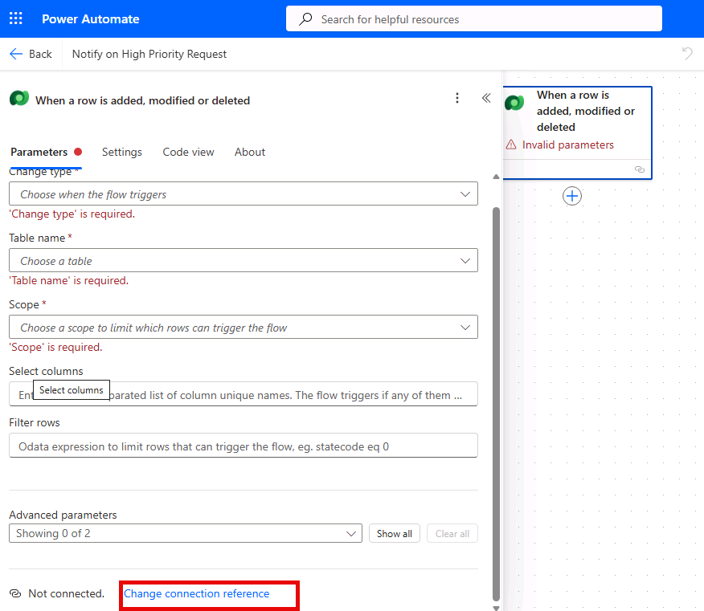
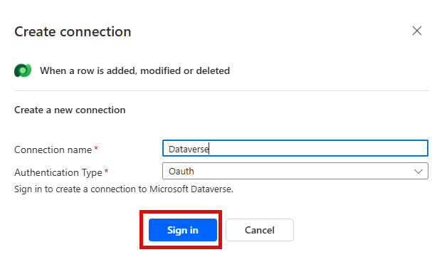
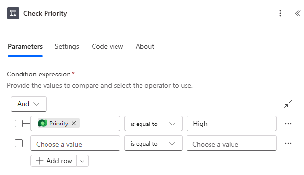

---
lab:
  title: 'ラボ 4: Power Automate フローを作成する'
  learning path: 'Learning Path: Demonstrate the capabilities of Microsoft Power Automate'
  module: Build a Power Automate flow
  description: このラボでは、Dataverse イベントによってトリガーされる自動化されたクラウド フローを Power Automate で作成します。 条件を構成し、優先度の高い施設要求が届いたらメール通知を送信します。
  duration: 30 minutes
  level: 100
  islab: true
  primarytopics:
    - Power Automate
---
# 実習ラボ 4 - Power Automate フローを作成する

**[推定時間]**: 30 分

## ラボの目的

このラボでは、次のことを学びます。

-   Power Automate 作成者エクスペリエンスに移動する
-   Dataverse イベントによってトリガーされる自動クラウド フローを作成する
-   条件とアクションをフローに追加する
-   組み込みのコネクタを使ってメール通知を送信する
-   フローをテストして監視する

## シナリオ

Contoso は、新しい優先度の高い施設要求が送信されるたびに、施設チームに自動的に通知したいと考えています。 新しい行が Facility Request テーブルに追加されたらトリガーし、優先度が高または緊急の場合はメール通知を送信する、自動クラウド フローを作成します。

## 演習 1: 自動クラウド フローを作成する

1.  新しいブラウザー ウィンドウで <Https://make.powerautomate.com> に移動し (またはアプリ起動ツールから Power Automate を選んで)、サインインします。
1.  環境を **Contoso (既定)** から **Dev One** に変更します
1.  左側のナビゲーションから **[+ 作成]** を選びます。
1.  **[自動クラウド フロー]** を選択します。

    

1.  フローに "**高優先度の要求で通知する**" という名前を付けます。
1.  トリガー検索ボックスで、"**行が追加されたとき**" を検索し、**[行が追加、変更、または削除されたとき (Microsoft Dataverse)]** を選びます。
1.  **Create** をクリックしてください。

    

## 演習 2: フローを構成する

> [!NOTE]
> トリガーのステップで "無効なパラメーター" と表示されることがあります。その場合は、新しい接続を構成する必要があることを意味します。 トリガーで "無効なパラメーター" と表示される場合は、次の手順のようにします。

1.  **[行が追加、変更、または削除されたとき]** トリガーを選びます。
1.  **[パラメーター]** ペインで、**[接続参照を変更する]** を選びます。

    

1.  **[新規追加]** を選択します。
1.  次のように接続を構成します。
    -   **接続名:** Dataverse
    -   **認証の種類:** Oauth
1.  **サインイン** ボタンを選択します。

    

1.  **[MoD 管理者]** アカウントを選びます。

接続参照を構成したら、トリガーを構成できます。

1.  トリガーのステップで、次の設定を構成します。
    -   **変更の種類:** **[追加]** を選びます。
    -   **テーブル名:** **Facility Requests** (前に作成したテーブル) を選びます。
    -   **スコープ:** **[組織]** を選びます (すべてのユーザーに対してトリガーするため)。

        

1.  右側の **Copilot** ペインで、次のコマンドを入力します。 "優先度が高かどうかを確認する条件を追加します。"

高優先度の要求に対してのみ通知を送信する必要があります。 優先度の値を調べる条件を追加します。

1.  新しく追加された条件を選び、次のように構成します。
    -   左側のボックスで、フィールドをクリックして **[優先度]** を選びます ([動的コンテンツ] から – これはトリガー出力にあります)。
    -   演算子を [等しい] に設定します。
    -   右側のボックスに [高] の値を入力します (通常、これは選んだ値です。選択の設定によっては、3 などの整数値の入力が必要な場合があります)。 繰り返して、緊急の or 条件を追加します。

        完成した条件は、"**優先度が高に等しい**" になる必要があります。

        

条件の作成が済んだので、通知メールの構成に進みます

1.  条件の **True/Yes** の場合の分岐で、**[アクションの追加]** をクリックします。
1.  "**メールの送信**" を検索し、**Office 365 Outlook** コネクタから **[メールの送信 (V2)]** を選びます。

    

1.  **[MoD 管理者]** アカウントを選びます

    **注:** **[サインイン]** ボタンを選ぶことが必要な場合があります。 (ブラウザーが接続認証ポップアップ ウィンドウをブロックしたというメッセージが表示される場合があります。その場合は、アドレス バーのポップアップ アイコンを選んで、[https://make.powerautomate.com) からのポップアップとリダイレクトを常に許可する] を選びます。)**

1.  メールを構成します。
    -   **宛先:** 自分のメール アドレスを入力します (テストのため)。
    -   **件名:** 「高優先度の施設要求: 」と入力し、トリガーから **Request Title** 動的コンテンツを挿入します。
    -   **本文:** 「新しい高優先度の施設要求が送信されました」と入力します。
    -   カテゴリ、優先度、説明の動的コンテンツを別々の行に追加します。

        完成したメールは次の図のようになります。

        

1.  "If no" 分岐は空のままにします (高優先度ではない要求にはアクションは必要ありません)。

## 演習 3: 保存してテストする

1.  右上にある [保存] をクリックします。
1.  フローをテストします。
    -   **Facility Request** テーブルを開きます (make.powerapps.com \> **[テーブル]** で、またはモデル駆動型アプリを使って)。
    -   **Priority** が **High** に設定された新しい行を追加します。
    -   Power Automate に戻り、フロー実行履歴 (28 日間の実行履歴セクションの下) をクリックして、フローが正常に実行されたことを確認します。
    -   メールの受信トレイで**通知**を確認します。
1.  フローがトリガーされなかったか失敗した場合は、実行エントリをクリックしてステップごとの詳細を確認し、エラーが発生した場所を特定します。
