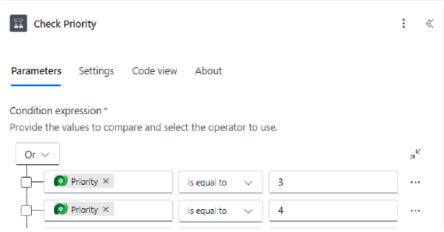

---
lab:
  title: 'ラボ 4: Power Automate フローを作成する'
  learning path: 'Learning Path: Demonstrate the capabilities of Microsoft Power Automate'
  module: Build a Power Automate flow
  description: このラボでは、Dataverse イベントによってトリガーされる自動化されたクラウド フローを Power Automate で作成します。 条件を構成し、優先度の高い施設要求が届いたらメール通知を送信します。
  duration: 30 minutes
  level: 100
  islab: true
  primarytopics:
    - Power Automate
---
# 実習ラボ 4 - Power Automate フローを作成する

**[推定時間]**: 30 分

## ラボの目的

このラボでは、次のことを学びます。

-   Power Automate 作成者エクスペリエンスに移動する
-   Dataverse イベントによってトリガーされる自動クラウド フローを作成する
-   条件とアクションをフローに追加する
-   組み込みのコネクタを使ってメール通知を送信する
-   フローをテストして監視する

## シナリオ

Contoso は、新しい優先度の高い施設要求が送信されるたびに、施設チームに自動的に通知したいと考えています。 新しい行が Facility Request テーブルに追加されたらトリガーし、優先度が高または緊急の場合はメール通知を送信する、自動クラウド フローを作成します。

## 演習 1: 自動クラウド フローを作成する

1.  新しいブラウザー ウィンドウで <https://make.powerautomate.com> に移動し (またはアプリ起動ツールから Power Automate を選んで)、サインインします。
1.  環境を **Contoso (既定)** から **Dev One** に変更します
1.  左側のナビゲーションから **[+ 作成]** を選びます。
1.  **[自動クラウド フロー]** を選択します。

    

1.  フローに "**高優先度の要求で通知する**" という名前を付けます。
1.  トリガー検索ボックスで、"**行が追加されたとき**" を検索し、**[行が追加、変更、または削除されたとき (Microsoft Dataverse)]** を選びます。
1.  **［作成］** を選択します

    

## 演習 2: フローを構成する

> [!NOTE]
> トリガーのステップで "無効なパラメーター" と表示されることがあります。その場合は、新しい接続を構成する必要があることを意味します。 トリガーで "無効なパラメーター" と表示される場合は、次の手順のようにします。

1.  **[行が追加、変更、または削除されたとき]** トリガーを選びます。
1.  **[パラメーター]** ペインで、**[接続参照を変更する]** を選びます。

    

1.  **[新規追加]** を選択します。
1.  次のように接続を構成します。
    -   **接続名:** Dataverse
    -   **認証の種類:** Oauth
1.  **サインイン** ボタンを選択します。

    

1.  **[MOD 管理者]** アカウントを選択します。

接続参照を構成したら、トリガーを構成できます。

7.  トリガーのステップで、次の設定を構成します。
    -   **変更の種類:** **[追加]** を選びます。
    -   **テーブル名:** **Facility Requests** (前に作成したテーブル) を選びます。
    -   **スコープ:** **[組織]** を選びます (すべてのユーザーに対してトリガーするため)。

        

1. **[行が追加、変更、または削除されたとき]** トリガーの下で **+** を選択してアクションを追加します。

1. `Get a row by ID` を検索し **Microsoft Dataverse** の下の **[ID で行を取得]** を選択します。

1. **[ID で行を取得]** の手順で、次の設定を構成します。
    -   **テーブル名:** **Facility Requests** (前に作成したテーブル) を選びます。
    -   **行 ID:** **[ダイナミック コンテンツ]** で、**[施設要求]** を選択します。

      ![[ID で行を取得] の構成を示すスクリーンショット](media/trigger-step.png)

1.  右側の **Copilot** ペインで、コマンド `Add a condition to see if the Priority is equal to high` を入力します。

高優先度の要求に対してのみ通知を送信する必要があります。 優先度の値を調べる条件を追加します。

12. 新しく追加された条件を選び、次のように構成します。
    -   左側のボックスで **[値の選択]** を選択し、次に **[ダイナミック コンテンツ]** の **[ID で行を取得]** の下の **[優先度]** を選択します。
    -   演算子を **[等しい]** に設定します。
    -   右側のボックスに、**[高]** の整数値を入力します。 この値を見つけるには、**[施設要求]** テーブルの **[優先順位]** 列に移動し、選択値を確認します。
    -   **[緊急]** の値の構成を繰り返します
    -   **[AND]** ドロップダウンを **[OR]** に変更します。

        完了した条件は、**[優先度]** 列の整数を使用して、**[優先度] が [高] と等しい**値と、[優先度] が [緊急] と等しい値にする必要があります。**

        

条件の作成が済んだので、通知メールの構成に進みます

13.  条件の If **True/Yes** の分岐で、**+** ボタンを選択して**アクションを追加**します。
1.  "**メールの送信**" を検索し、**Office 365 Outlook** コネクタから **[メールの送信 (V2)]** を選びます。

    

1.  **[サインイン]** を選択し、**[MOD 管理者]** アカウントを選択します
> [!NOTE]
> **[サインイン]** ボタンを選ぶことが必要な場合があります。 (ブラウザーが接続認証ポップアップ ウィンドウをブロックしたというメッセージが表示される場合があります。その場合は、アドレス バーのポップアップ アイコンを選んで、[https://make.powerautomate.com) からのポップアップとリダイレクトを常に許可する] を選びます。)**

16. メールを構成します。
    -   **宛先:** 自分のメール アドレスを入力します (テストのため)。
    -   **件名:** `High Priority Facility Request:` と入力し、ダイナミック コンテンツから **[要求タイトル]** を挿入します。
    -   **本文:** `A new high-priority facilities request has been submitted.` と入力し、**[ID で行を取得]** の下の **ダイナミック コンテンツ**から次のフィールドを、それぞれ行を分けて追加します。
        -   **カテゴリ**
        -   **優先順位**
        -   **説明**

        完成したメールは次の図のようになります。

        

1.  If **False/No** の分岐は空のままにします (高優先度ではない要求にはアクションは必要ありません)。

## 演習 3: 保存してテストする

1.  右上隅の **保存** を選択します。
1.  フローをテストします。
    -   **Facility Request** テーブルを開きます (make.powerapps.com \> **[テーブル]** で、またはモデル駆動型アプリを使って)。
    -   **Priority** が **High** に設定された新しい行を追加します。
    -   Power Automate に戻り、**[マイ フロー]** を選択し、**[28 日間の実行履歴]** セクションで、フローが正常に実行されたことを確認します。
    -   メールの受信トレイで**通知**を確認します。
1.  フローがトリガーされなかった、または失敗した場合は、実行エントリを選択してステップごとの詳細を確認し、エラーが発生した場所を特定します。 **[再送信]** を選択し、フローをもう一度実行してみます。
