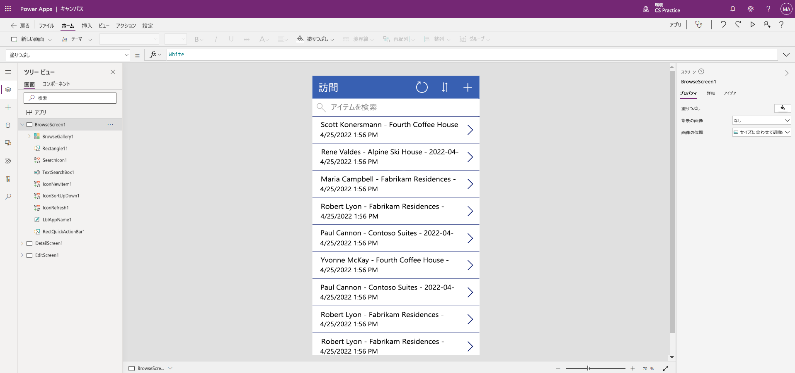

---
lab:
  title: 'ラボ 2:キャンバス アプリをビルドする方法'
  module: 'Module 3: Get started with Power Apps'
---

# ラボ 2:キャンバス アプリをビルドする方法

**WWL テナント - 使用条件** 講師による指導付きトレーニング配信の一環としてテナントを提供されている場合、テナントは講師による指導付きトレーニングでハンズオン ラボをサポートする目的で利用できます。 テナントを共有したり、ハンズオン ラボ以外の目的で使用したりしないでください。 このコースで使われるテナントは試用版テナントであり、クラスが終了し、拡張機能の対象となっていない場合は、使用したりアクセスしたりすることはできません。 テナントを有料サブスクリプションに変換することはできません。 このコースの一環として取得したテナントは Microsoft Corporation の財産のままであり、当社はいつでもアクセス権とリポジトリを取得する権利を留保します。 

## シナリオ

ベローズ カレッジは、キャンパス内に複数の建物を持つ教育機関です。 キャンパス訪問は現在、紙の記録簿に記録されています。 その情報は一貫して把握されておらず、キャンパス全体の訪問に関するデータを収集して分析する手段もありません。

現在、キャンパス管理では、Excel スプレッドシートを利用して訪問者の登録を追跡しています。 現在の訪問者登録システムでは、建物へのアクセスがセキュリティ担当者によって管理されており、すべての訪問を訪問先で事前に登録し、記録する必要があるため、カレッジではこのシステムを最新化したいと考えています。

このコース全体を通して、アプリケーションを構築するとともに自動化を行って、ベローズ カレッジの管理担当者とセキュリティ担当者がキャンパス内の建物へのアクセスを管理および制御できるようにします。

## ラボ手順の概要

キャンバス アプリを設計するには、以下の概要に従います。

- 訪問テーブルのデータからキャンバス アプリを作成する

- 訪問を参照画面に表示する方法を構成する

- アプリにいくつかの基本的な変更を加える

- アプリの機能をテストする

## 前提条件

- **モジュール 0 ラボ 0 - ラボ環境の検証**の完了
- **モジュール 2 ラボ 1 - データ モデリング**の完了

## 演習 1:訪問キャンバス アプリを作成する

**目的:** この演習では、以前に作成した訪問テーブルを接続して、キャンバス アプリを作成します。

### タスク \#1:訪問アプリを作成する

1.  `https://make.powerapps.com` に移動します

2.  再認証が必要な場合は、**[サインイン]** を選び、必要に応じて指示に従ってください。

3.  まだ選んでいない場合は、右上隅の **Dev One** 環境を選びます。

4.  画面の左側のナビゲーションから **[+ 作成]** を選択します。 **[開始]** セクションで、 **[Dataverse]** を選択します。

5.  Dataverse 接続を選択します。

    > **注:**  *Dataverse 接続が存在しない場合:*
    > - **[+新しい接続]** を選択します
    > - **[Microsoft Dataverse]** を見つけます
    > - **[作成]**
    > - **サインイン**し、 **[アクセスを許可]** を選択します

6.  前のラボで作成した **[訪問]** テーブルを見つけて選択します。

7.  右下隅にある **[接続]** ボタンを選びます。

8.  アプリが作成されたら、[Power Apps Studio へようこそ] 画面で、 **[今後は表示しない]** を選択してから、 **[スキップ]** を選択します。

9.  作成が完了すると、キャンバス アプリは次の図のようになります。

    

10.  アプリ デザイナーのコマンド バーで、 **[アプリのプレビュー]** ボタン (再生アイコン) を選択します。 "(F5 キーを押してアプリをプレビューすることもできます。)" 使ってみて、アプリがすぐに使用できる状態であることを確認します。**

11. 画面の右上にある **X** を選択して、アプリのプレビューを閉じます。

これで、Dataverse テーブルから Power App が正常に作成されました。 プロセスの次のステップは、Bellows College のブランドに合わせてアプリを調整することです。 次の一連の手順では、いくつかの点でアプリをさらにカスタマイズする手順について説明します。

### タスク \#2:新しく作成したアプリのテーマを変更する

このタスクでは、アプリの 3 つの各画面 ([参照]、[詳細]、[編集]) のヘッダー テキストをカスタマイズし、アプリ テーマを変更します。 

1.  [参照] 画面が表示されます。 画面上の **[訪問]** ラベルを選びます。

1.  画面の右側にある [プロパティ] タブで、 **[テキスト]** コントロール プロパティを `Bellows College Visits` に更新します

1.  **[プロパティ]** タブで、 **[フォント サイズ]** を **[24]** に変更します。 

1.  画面の空白の背景を選択すると、[参照] 画面に更新されたテキストが表示されます。 

1.  左側のナビゲーションの**ツリー ビュー**を使用して、 **[DetailScreen1]** を選択します。 

1.  画面上の **[訪問]** ラベルを選びます。

1.  画面の右側にある **[プロパティ]** タブで、 **[テキスト]** コントロール プロパティを `Visit Details` に更新します

1.  画面の空白の背景をクリックすると、[詳細] 画面に更新されたテキストが表示されます。

1.  左側のナビゲーションにある**ツリー ビュー**を使用して、 **[EditScreen1]** を選びます (ツリー ビューでこれを表示するには、下にスクロールすることが必要な場合があります)。

1.  画面上の **[訪問]** ラベルを選びます。

1.  画面の右側にある **[プロパティ]** タブで、 **[テキスト]** コントロール プロパティのテキストを `Edit Details` に置き換えます

1.  画面の空白の背景をクリックすると、[編集] 画面に更新されたテキストが表示されます。

1.  左側のナビゲーションの**ツリー ビュー**を使用して、 **[BrowseScreen1]** を選択します。

1.  コマンド ツール バーで、 **[テーマ]** ボタンを選択し、表示された一覧で、テーマの色として **[赤]** を選択します。

### タスク \#3:訪問アプリをテストする

このタスクでは、新しいアプリをテストします。

1.  アプリ デザイナーでアプリケーションを開き、 **[設定]** を選択し、 **[全般]** セクションでアプリの名前を `Visits App` に更新し、 **[X]** を選択して設定画面を閉じ、 **[保存]** を選択します。

2.  左側のナビゲーションを使用して、 **[参照画面 1]** を選択します。

3.  アプリ デザイナーのコマンド バーで、 **[アプリのプレビュー]** ボタン (再生アイコン) を選択します。 "(F5 キーを押してアプリをプレビューすることもできます。)"**

4.  アプリが開いたら、 **[項目の検索]** フィールドに、テキスト `Maria`
    * を入力します (検索フィールドに入力された内容に基づいて、ギャラリー内の項目がどのようにフィルター処理されるかに注目してください)。*

5.  **Maria Campbell** の **Contoso Suites** レコードが表示されたら、行をクリックしてその訪問の詳細画面に移動し、開きます。 (**注**: "Maria Campbell の Contoso Suites レコードが複数表示される場合、いずれかを選択します。")**

6.  レコードを編集するには、アプリの右上隅にある **鉛筆アイコン**を選択します。

7.  ここで、**訪問名**を編集することができます。右上隅の**チェックマーク** アイコンを選択すると、変更を保存することができます。

8.  画面の右上隅にある **[X]** アイコンを選択すると、プレビュー モードが終了し、キャンバス アプリ エディターに戻ります。

お疲れさまでした。 最初のキャンバス アプリの作成と構成が完了しました。

