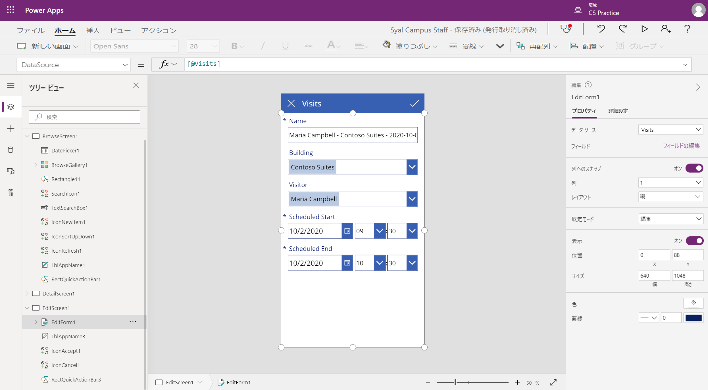
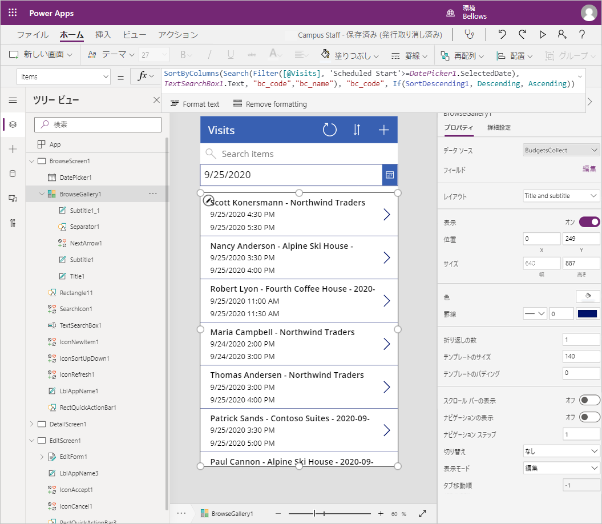

---
lab:
  title: ラボ 2:キャンバス アプリをビルドする方法、パート 1
  module: 'Module 3: Get started with Power Apps'
ms.openlocfilehash: ac6cec75309098dae7715c0bdf42db75c9b80429
ms.sourcegitcommit: ef58c858463b890e923ef808b1d43405423943fd
ms.translationtype: HT
ms.contentlocale: ja-JP
ms.lasthandoff: 01/27/2022
ms.locfileid: "137898895"
---
# <a name="module-3-get-started-with-power-apps"></a>モジュール 3:Power Apps の概要

## <a name="lab-how-to-build-a-canvas-app-part-1"></a>ラボ:キャンバス アプリをビルドする方法、パート 1

# <a name="scenario"></a>シナリオ

ベローズ カレッジは、キャンパス内に複数の建物を持つ教育機関です。 キャンパス訪問は現在、紙の記録簿に記録されています。 その情報は一貫して把握されておらず、キャンパス全体の訪問に関するデータを収集して分析する手段もありません。 

キャンパスの管理者は、建物へのアクセスがセキュリティ担当者によって管理され、すべての訪問者がホストによって事前に登録され、記録されることが要求される訪問者登録システムを近代化したいと考えています。

このコース全体を通して、アプリケーションを構築するとともに自動化を行って、ベローズ カレッジの管理担当者とセキュリティ担当者がキャンパス内の建物へのアクセスを管理および制御できるようにします。  

このラボのパート 1 では、大学の職員がゲストの訪問を管理するために使用できる Power Apps キャンバス アプリを設計します。

# <a name="high-level-lab-steps"></a>ラボ手順の概要

キャンバス アプリを設計するには、以下の概要に従います。

-   電話フォーム ファクター テンプレートを使用してデータからアプリを作成します
-   訪問情報を使用して詳細ページを構成する
-   訪問用に作成する編集ページを構成する
-   訪問を表示するためにギャラリー コントロールを構成する
-   ギャラリー データ ソースにフィルター処理を追加して、今後の訪問のみを表示する

## <a name="prerequisites"></a>前提条件

* **モジュール 0 ラボ 0 - ラボ環境の検証** の完了
* **モジュール 2 ラボ 1 - Common Data Service の概要** の完了

## <a name="things-to-consider-before-you-begin"></a>始める前に考慮すべきこと

-   対象者にとって最も一般的なフォーム ファクターは何か?
-   システム内のレコード数を推定します 
-   アプリのパフォーマンスとユーザーによる採用を向上させるために選択したレコードを絞り込む方法

# <a name="exercise-1-create-staff-canvas-app"></a>演習 \#1:スタッフ キャンバス アプリの作成

**目的:** この演習では、テンプレートからキャンバス アプリを作成し、必要なデータを含むように変更します。

## <a name="task-1-create-canvas-app"></a>タスク \#1:キャンバス アプリを作成する

このタスクでは、 Microsoft Dataverse に基づく電話レイアウトテンプレートを使用してキャンバスアプリを作成します。 Dataverse から選択したテーブルとして訪問を使用して、テンプレートは、キャンパス訪問を管理するギャラリー - 表示 - 編集アプリを生成します。

1.  データからアプリの作成を開始する

    -   <https://make.powerapps.com> にサインインします

    -   自分の演習環境にまだ設定されていない場合は、右上で対象の **環境** を選択します。

    -   ホーム画面の「**データから開始**」内の「**Dataverse** 」アイコンを選択します。

2.  Visits テーブルに接続します
    
    -   「 **+ 新しい接続**」を選択します。

    -   「**Microsoft Dataverse**」を選択し、「**作成**」をクリックします

    -   **Visits** テーブルを検索して選択します。

    -   **[接続]** を選択します

3.  「**Power Apps Studio へようこそ**」ウィンドウが表示される場合があります。 「**スキップ**」をクリックします。

4.  アプリケーションを保存します

    -   **[ファイル] \> [保存]** をクリックします。

    -   アプリ名として、「 **[姓] キャンパス スタッフ**」と入力します。

    -   **[保存]** をクリックします。

## <a name="task-2-configure-visits-detail-form"></a>タスク \#2:訪問の詳細フォームを構成する

このタスクでは、個々の訪問レコードに関する情報を表示する詳細フォームを構成します。

1. 左上の「**戻る**」矢印を選択して、アプリ定義に戻ります。

2. **ツリー ビュー** で **DetailScreen1** を展開します

3.  **DetailForm1** を選択します

4.  右側のパネルの「**フィールド**」の横にある「**フィールドの編集**」を選択します。

5.  「**フィールドの追加**」をクリックします。

6.  次のフィールドを選択します:

    * 実際の終了
    
    * 実際の開始
    
    * ビルド 
    
    * コード
    
    * 終了予定
    
    * 開始予定
    
    * ビジター
    
7.  **[追加]** をクリックします。

8.  フィールド名を上下にドラッグ アンド ドロップして、「**フィールド**」ペインのフィールドを再配置します。 推奨される順序は次のとおりです。
    * コード、名前、建物、訪問者、終了予定、開始予定、実際の開始、実際の終了
    >**ヒント:** 各フィールドを折りたたむには、フィールド名の横にある下矢印をクリックします。

9.  **[作成日時]** フィールドを削除するには、フィールド名の横にある省略記号 ( **[...]** ) をクリックして **[削除]** を選択します。 

10.  「**フィールド**」ペインを閉じます。
 
11.  進行中の作業を保存するには、「**ファイル**」をクリックし、次に「**保存**」をクリックします 戻る矢印を使用して、アプリに戻ります。

## <a name="task-3-configure-visits-edit-form"></a>タスク \#3:訪問の編集フォームを構成する

このタスクでは、個々の訪問行に関する情報を編集するフォームを構成します。

1.  **[ツリー ビュー]** の下の **[EditScreen1]** を展開します。

2.  **[EditForm1]** を選択します。

3.  「**作成した** フィールド」を選択し、**Del** キーを押してフィールドを削除します

4.  プロパティ パネルで「**フィールドの編集**」を選択します。

5.  「**フィールドの追加**」をクリックします。

6.  次のフィールドを選択します:

    * ビルド 
    
    * 終了予定
    
    * 開始予定
    
    * ビジター
    
7.  **[追加]** をクリックします。

8.  フィールド名を上下にドラッグ アンド ドロップして、「**フィールド**」ペインのフィールドを再配置します。 推奨される順序は次のとおりです。
    
    * 名前、建物、訪問者、開始予定、終了予定
    >**ヒント:** 各フィールドを折りたたむには、フィールド名の横にある下矢印をクリックします。 

9.  「**フィールド**」ペインを閉じます。

10.  進行中の作業を保存するには、「**ファイル**」をクリックし、次に「**保存**」をクリックします 戻る矢印を使用して、アプリに戻ります。

スクリーンはおおよそ次のようになります。



## <a name="task-4-configure-visits-gallery"></a>タスク \#4:訪問ギャラリーを構成する

このタスクでは、事前に生成されたギャラリーを構成して、訪問のタイトル、開始日、終了日を表示します。 

1.  **ツリー ビュー** で **BrowseScreen1** を展開します

2.  **BrowseGallery1** を選択します

3.  右側の「詳細プロパティ」パネルから「**TemplateSize**」プロパティを選択します

4.  式を「`Min(150, BrowseGallery1.Height - 60)`」に置き換えます。 これにより、追加情報を確保するのに十分なスペースが確保されます。

5.  アプリ プレビューで、ギャラリーの最初の「日時」フィールドを選択します。

6.  上部の数式バーで、「**ThisItem.'Created On'** 」を「`ThisItem.'Scheduled Start'`」に変更します。

7.  フィールドをもう一度選択します。

8.  **CTRL-C** を押してから **CTRL-V** を押して、フィールドのコピーを作成します。

9.  マウスまたはキーボードを使用して、コピーしたコントロールを下に移動し、ギャラリー内の他の「日時」フィールドの下にある他のコントロールと位置を合わせます。

10.  上部の数式バーで、「**ThisItem.'Scheduled Start'** 」を「`ThisItem.'Scheduled End'`」に変更します。

11.  進行中の作業を保存するには、「**ファイル**」をクリックし、次に「**保存**」をクリックします 戻る矢印を使用して、アプリに戻ります。

## <a name="task-5-add-date-filter"></a>タスク #5:日付フィルターを追加する

訪問数は増加し続けるため、ユーザーは訪問ギャラリーをフィルタリングする機能が必要です。 たとえば、ユーザーは今後の訪問のみを表示できます。 このタスクでは、ユーザーが選択した日付の後にのみ訪問を表示する機能を追加します。

1. **[BrowseScreen1]** を選択します。

2. 上部の「**挿入**」メニューを選択します。

3. 「**入力**」をクリックし、「**日付の選択**」を選択します。

4. キーボードまたはマウスを使用して、検索ボックスの下にコントロールを配置します。

5. **BrowseGallery1** を選択します 

6. ギャラリー コントロールのサイズを変更して移動し、日付の選択の下に配置し、画面を覆います。 これを行うには、ギャラリー コントロールの上部中央にあるサイズ変更アイコンをクリックし、日付の選択後に開始するようにコントロールのサイズを変更します。

7. 「**BrowseGallery1**」を選択した状態で、「プロパティ」ペインの「**詳細**」タブをクリックします。

8. 「**アイテム**」プロパティを見つけて、テキスト ボックスをクリックします。

9. 式で「 **[@Visits]** 」を探し、「`Filter(Visits,'Scheduled End' >= DatePicker1.SelectedDate)`」に置き換えます。 完全な式は次のようになります。

   ```
   SortByColumns(
    Search(
        Filter(
            Visits,
            'Scheduled End' >= DatePicker1.SelectedDate
           ),
           TextSearchBox1.Text,
        "bc_code","bc_name"
       ),
     "bc_scheduledstart",
     If(SortDescending1, Descending, Ascending)
   )
   ```
   
10. 進行中の作業を保存するには、「**ファイル**」をクリックし、次に「**保存**」をクリックします 戻る矢印を使用して、アプリに戻ります。

スクリーンはおおよそ次のようになります。



# <a name="exercise-2-complete-the-app"></a>演習 2:アプリの完成

この演習では、アプリケーションをテストし、成功したらソリューションに追加します。

## <a name="task-1-test-app"></a>タスク \#1:アプリをテストする

1.  アプリケーションの起動

    -   「**BrowseScreen1**」を選択して **F5** キーを押すか、右上隅にある「**再生**」アイコンをクリックしてアプリをプレビューします。
    
    -   アプリケーションが読み込まれ、訪問のリストが表示されます。 
    
    -   日付の選択コントロールで別の日付を選択してフィルターをテストします
    
    -   訪問を選択し、表示フォームが正しく動作していることを確認します
    
    -   ギャラリーに戻り、 **+** を押して新しい訪問を作成します。 編集フォームに、訪問者、建物、およびスケジュールされた開始日と終了日などの必須列が含まれていることを確認します。
    
    -   情報を入力して送信します。 新しいレコードがギャラリーに表示されることを確認します。
    
    -   少なくともさらに 2 回の訪問を作成します。
    
    -   **ESC** キーを押すか、「**X**」アイコンをクリックしてプレビュー モードを閉じます。

2.  アプリケーションを保存して公開する

    -   「**ファイル**」をクリックし、「保存」ボタンが表示されたら、「**保存**」をクリックします。

    -   **[発行]** をクリックします。

    -   「**このバージョンを公開する**」をクリックします。

    -   「**戻る**」矢印をクリックして、アプリに戻ります。

    -   **デザイナー** のブラウザーの画面またはタブを閉じます。

    -   ブラウザーの画面を閉じようとしたときにメッセージが表示されたら、「**脱退**」をクリックします。

## <a name="task-2-add-app-to-solution-and-publish"></a>タスク #2:アプリをソリューションに追加して公開する 

1. Campus Management ソリューションを開きます。

   * <https://make.powerapps.com> にサインインします
   
   * 右上に表示されている環境が演習環境でない場合は、「**環境**」を選択します。 
   
   * 「**ソリューション**」を選択します。
   
   * 「**Campus Management**」ソリューションをクリックして開きます。
   
2. 「**既存のアプリを追加**」を選択し、「**アプリ**」をクリックして、「**キャンバス アプリ**」をクリックします。

3. **[Outside Dataverse]\(外部の Dataverse\)** タブを選択します。

4. 「**キャンパス スタッフ**」アプリを選択し、「**追加**」をクリックします。

5. 「**すべてのカスタマイズを公開**」を選択します。

# <a name="challenges"></a>課題

* すべての訪問数のカレンダー ビューと日付範囲によるフィルタリング
* アプリの一部として連絡先を作成および管理する機能
* 1 回の訪問で複数の会議を表示する方法

