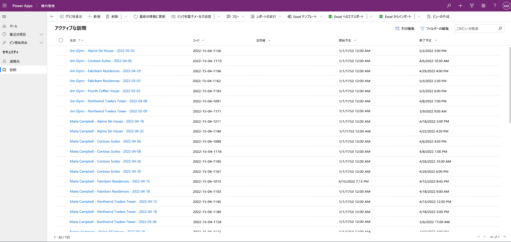

---
lab:
  title: 課題 3:モデル駆動型アプリをビルドする方法
  module: 'Module 3: Get started with Power Apps'
ms.openlocfilehash: ed98e1f2c2ff900f84b98910e0ef2d14d130f462
ms.sourcegitcommit: dbffa13e13419f5b9aadc894eb95fd16215b2ebf
ms.translationtype: HT
ms.contentlocale: ja-JP
ms.lasthandoff: 06/17/2022
ms.locfileid: "146458376"
---
# モジュール 3:Power Apps の概要
## ラボ:モデル駆動型アプリをビルドする方法

# シナリオ

ベローズ カレッジは、キャンパス内に複数の建物を持つ教育機関です。 キャンパスの訪問者は現在、紙の日誌に記録されています。 その情報は一貫して把握されておらず、キャンパス全体の訪問に関するデータを収集して分析する手段もありません。

キャンパスの管理者は、建物へのアクセスがセキュリティ担当者によって管理され、すべての訪問者がホストによって事前に登録され、記録されることが要求される訪問者登録システムを近代化したいと考えています。

このコース全体を通して、アプリケーションを構築するとともに自動化を行って、ベローズ カレッジの管理担当者とセキュリティ担当者がキャンパス内の建物へのアクセスを管理および制御できるようにします。

このラボでは、Power Apps のモデル駆動型アプリを作成し、バックオフィスのキャンパス スタッフがキャンパス全体の訪問レコードを管理できるようにします。

ラボ手順の概要

モデル駆動型アプリを作成する一環として、次の手順を実行します。

- "キャンパス管理" という名前の新しいモデル駆動型アプリを作成する

- アプリのナビゲーションを編集して必要なテーブルを参照する

- アプリに必要なテーブルのフォームとビューをカスタマイズする

次のコンポーネントを操作します。

- **ビュー**:ビューを使用すると、ユーザーはフォーム テーブルに既存のデータを表示できます。

- **フォーム**: ここで、ユーザーはテーブル内の新しい行を作成または更新します。

両方のコンポーネントは、より良いユーザー エクスペリエンスのためにモデル駆動型アプリに統合されます。

前提条件

- **モジュール 0 ラボ - ラボ環境の検証** の完了

- **モジュール 2 ラボ - データ モデリング** の完了

- **モジュール 3 ラボ - キャンバス アプリを構築する方法** の完了

始める前に考慮すべきこと

- ユーザー エクスペリエンスを向上させるためにどのような変更を加える必要がありますか。

- 構築したデータ モデルに基づいて、モデル駆動型アプリに何を含める必要がありますか?

- モデル駆動型アプリのサイトマップで行うことができるカスタマイズは何ですか。

演習 #1: ビューとフォームのカスタマイズ

**目的:** この演習では、モデル駆動型アプリで使用されるカスタム作成されたテーブルのビューとフォームをカスタマイズします。

タスク #1:訪問フォームを編集する

1. まだサインインしていない場合は、[https://make.powerapps.com](https://make.powerapps.com/) にサインインします。

2. **[[自分のイニシャル] 練習]** 環境がまだ選択されていない場合は、右上で選択します。

3. 左側のナビゲーションを使用して、 **[Dataverse]** を展開し、 **[テーブル]** を選択して **[訪問]** テーブルを開きます。

訪問テーブルが表示されない場合は、正しい環境であることを確認します (手順 2)。

4. [データ エクスペリエンス] セクションで、 **[フォーム]** を選択し、フォームの種類 **[メイン]** をクリックして情報フォームを開きます。

**重要:** すべてのフォームは既定で "情報" という名前が付けられるため、選択したフォームが **[メイン]** という種類のフォームであり、それ以外ではないことを確認してください。 既定では、フォームに次の 2 つのフィールドがあります。名前 (プライマリ フィールド) と所有者。

5. 画面の右側の [プロパティ] パネルで、**[表示名]** フィールドを選択し、それを「**メイン情報**」に変更します。

6. 画面の上部にあるメニューを使用して **[+ フォーム]** フィールドを選択し、列をフォームにドラッグするか、単に列名をクリックして、 **[所有者]** フィールドの下に以下のフィールドを追加します。

    0. **ビジター**

    1. **開始予定**

    2. **終了予定**

    3. **実際の開始日**

    4. **実際の終了日**

7. **[コード]** 列をドラッグして、フォーム ヘッダーにドロップします。

ヘッダーはフォームの右上の領域です。 フォームのフィールドを表示するには、必要に応じて画面の右側にある [プロパティ] パネルを折りたたみます。

8. **[コード]** フィールドを選択したまま、画面の右側にある [プロパティ] パネルで、 **[読み取り専用]** のチェックボックスをオンにします。

9. **[所有者]** を選択します。 [プロパティ] パネルで、**[ラベル]** を「**ホスト**」に変更します。

10. 右上の **[保存]** をクリックして、保存が完了するまで待ちます。

11. 右上の **[公開]** をクリックして、公開が完了するまで待ちます。

12. 編集ビューが新しいブラウザー タブまたはウィンドウで開いている場合は、それを閉じます。 それ以外の場合は、画面左上の **[戻る]** をクリックします。 これで、訪問テーブルの [フォーム] タブに戻るはずです。

13. 左上の階層リンクを使用します ([テーブル] > [訪問] > [フォーム])。 **[訪問]** を選択して、 **[訪問]** テーブルのメイン画面に戻ります。 

タスク #2:[アクティブな訪問] ビューを編集する

このタスクでは、既定の [アクティブな訪問] ビューを変更して、今日の訪問についての新しいビューを作成します。

1. [データ エクスペリエンス] セクションで、 **[ビュー]** を選択し、 **[アクティブな訪問]** ビューをクリックして開きます。

2. フィールドをクリックまたはドラッグアンドドロップして、次のフィールドをビューに追加します。

    0. **コード**

    1. **ビジター**

    2. **開始予定**

    3. **終了予定**

3. **[作成日]** 列をクリックし、**[削除]** を選択します。 **"作成日"** フィールドがビューから削除されます。

4. データに合わせて列幅を変更します。

5. **[保存]** をクリックし、変更が保存されるまで待ちます。

6. **[公開]** をクリックし、公開が完了するまで待ちます。

タスク #3:今日の訪問についての新しいビューを作成する

ここで、ビューをクローンして、今日の訪問についての新しいビューを作成します。

重要:重要: [アクティブな訪問] ビューは、今日の訪問についての新しいビューの作成に利用するため、閉じないようにしてください。 

1. [保存] ボタンの横にある **下向き矢印** をクリックし (ボタン自体を押さないように注意してください)、**[名前を付けて保存]** を選択します。

2. 名前を **[今日の訪問]** に変更し、 **[保存]** を押します。

3. [プロパティ] パネルで **[フィルターの編集]** リンクをクリックします。

4. **[追加]** をクリックし、**[行の追加]** を選択します。

5. **"開始予定"** をフィールドとして選択し、**[今日]** をドロップダウンの条件として選択します。

6. **[スキーマ]** プロパティで **[状態]** 行で **[削除]** をクリックして、そのフィルター条件を削除します。

7. **[OK]** をクリックして、条件を保存します。 このビューは、スケジュールされた開始日が今日のレコードのみを表示するようにフィルター処理されます。

8. **"実際の開始"** フィールドと **"実際の終了"** フィールドをビューに追加します。

**注:**  ビューの状態をフィルター処理しないため、完了した訪問を含む今日の訪問をすべて取得します。 これらのフィールドは、完了した訪問と進行中の訪問を区別するのに役立ちます。

1. **[保存]** をクリックします。

2. **[公開]** をクリックし、公開が完了するまで待ちます。

演習 2:モデル駆動型アプリケーションの作成

**目的:** この演習では、モデル駆動型アプリを作成し、サイトマップをカスタマイズして、アプリをテストします。

わかりやすくするため、また時間の都合上、このラボでは一部の [訪問] 列については説明しません。

タスク #1:アプリケーションを作成する

1. [https://make.powerapps.com](https://make.powerapps.com/) にサインインします (まだサインインしていない場合)。

2. **[[自分のイニシャル] 練習]** 環境がまだ選択されていない場合は、右上で選択します。

3. モデル駆動型アプリケーションを作成します。

    0. ホーム画面の **[開始]** セクションで **[空のアプリ]** を選択します。

    1. **[Dataverse に基づく空のアプリ]** で、 **[作成]** を選択します。

    2. [名前] に「**Bellows Campus 管理**」と入力し、**[作成]** を選択します。

4. 新しいモデル駆動型アプリケーションが読み込まれたら、 **[+ ページの追加]** ボタンを選択します。

5. [ページの追加] 画面で、 **[テーブル ベースのビューとフォーム]** を選択し、 **[次へ]** ボタンを選択します。

6. 次のテーブルを追加します。

    0. アクセスする

    1. Contact

7. この 2 つのテーブルを選択したら、 **[追加]** を選択します。

8. 画面の左側にあるナビゲーション アイコンを使用して、 **[ナビゲーション]** を選択します。

9. ナビゲーション ウィンドウで、ナビゲーション バーと表示されている項目の下にある **[グループ 1]** を選択します。

10. 画面の右側にある **[表示オプション]** セクションで、 **[タイトル]** プロパティを **[セキュリティ]** に変更します。

タスク #2:アプリを編集する

必要なコンポーネントがすべてモデル駆動型アプリケーションに追加されたので、項目を整理します。

1. ナビゲーション ウィンドウのセキュリティ グループで、 **[サブエリア 1]** を選択します。

2. **[省略記号]** を選択し、表示されたメニューで、 **[サブエリア 1]** を選択します。

3. 画面の左側にあるナビゲーションを使用して、 **[ページ]** を選択します。

4. [ページ] ペインで **[訪問]** を見つけて展開します。

5. **[訪問フォーム]** を選択します。

6. 画面の右側で **[フォームの追加]** を選択します。

7. **[メイン情報]** フォームを選択します。

8. [ページ] ペインの **[訪問]** にある、 **[訪問ビュー]** を選びます。

9. 画面の右側で **[ビューの追加]** を選択します。

10. **[今日の訪問]** ビューを選択します。

11. **[ビューの追加]** をもう一度選択します。 

12. **[アクティブな訪問]** ビューを選択します。 

13. **[保存]** を選択します。

14. **[保存]** が完了したら、 **[発行]** ボタンを選択して、変更を発行します。

タスク #3:アプリケーションをテストする

1. アプリケーションの起動

    0. **[再生]** を選択して、新しいウィンドウでアプリを開きます。

2. 新しい連絡先を作成します

    0. アプリでは、 **[自分のアクティブな連絡先]** ビューが開きます。 そうでない場合は、左側の [訪問] を選択します。

    1. トップ メニューで **[新規]** をクリックします。

    2. **[名]** に「John」、 **[姓]** に「Doe」と入力します。

    3. メール アドレスに個人用 **メール** を指定します。 これは、メールを受信する今後のラボで使用されます。

    4. **[保存して閉じる]** をクリックします。

    5. これで、**アクティブな連絡先** ビューに作成された連絡先が表示されます。

3. 新しい訪問を作成します

    0. サイトマップから **[訪問]** を選択します。

    1. **[新規作成]** をクリックします。

    2. 次のフィールドを入力します。

        0. **[名前]** : 新しいテスト訪問

        1. **訪問者**:John Doe を選択します

        2. **開始予定**: 開始時刻として、明日の日付と午後 2:00 を選択します

        3. **終了予定**: 終了時刻として、明日の日付と午後 3:30 を選択します

- **[保存して閉じる]** をクリックします。 これにより訪問が作成され、アクティブな建物ビューに表示されるようになります。

- ビューを **[今日の訪問]** に変更します。 新しい訪問は明日に予定されているため、ビューに表示されなくなります。

4. さらにテスト レコードを追加できます。

起動中のアプリは次のようになります。

お疲れさまでした。 最初のモデル駆動型アプリの作成と構成を完了しました。

# 課題

-   連絡先の特定のビューやフォームを選択してみましょう
