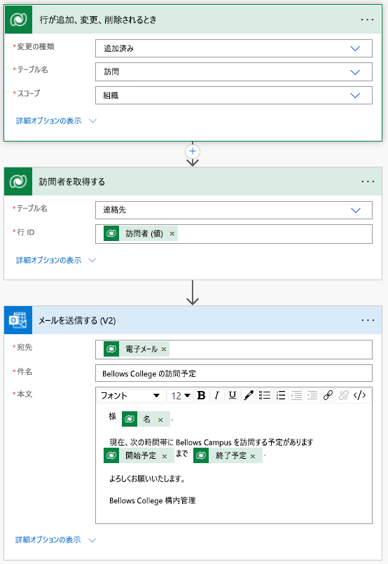

---
lab:
  title: 'ラボ 4:自動化ソリューションの構築方法'
  module: 'Module 4: Get Started with Power Automate'
---

# ラボ 4:自動化ソリューションの構築方法

**WWL テナント - 使用条件** 講師による指導付きトレーニング配信の一環としてテナントを提供されている場合、テナントは講師による指導付きトレーニングでハンズオン ラボをサポートする目的で利用できます。 テナントを共有したり、ハンズオン ラボ以外の目的で使用したりしないでください。 このコースで使われるテナントは試用版テナントであり、クラスが終了し、拡張機能の対象となっていない場合は、使用したりアクセスしたりすることはできません。 テナントを有料サブスクリプションに変換することはできません。 このコースの一環として取得したテナントは Microsoft Corporation の財産のままであり、当社はいつでもアクセス権とリポジトリを取得する権利を留保します。 

## シナリオ

ベローズ カレッジは、キャンパス内に複数の建物を持つ教育機関です。 キャンパスの訪問者は現在、紙の日誌に記録されています。 その情報は一貫して把握されておらず、キャンパス全体の訪問に関するデータを収集して分析する手段もありません。

キャンパスの管理者は、建物へのアクセスがセキュリティ担当者によって管理され、すべての訪問者がホストによって事前に登録され、記録されることが要求される訪問者登録システムを近代化したいと考えています。

このコース全体を通して、アプリケーションを構築するとともに自動化を行って、ベローズ カレッジの管理担当者とセキュリティ担当者がキャンパス内の建物へのアクセスを管理および制御できるようにします。

このラボでは、訪問がスケジュールされたときに訪問者にメールを送信する Power Automate フローを作成します。

## ラボ手順の概要

プロジェクトの完了に必要な要件は次のとおりです。

- 訪問がスケジュールされたときに、連絡先にはメールで通知する必要があります。

## 前提条件

- **モジュール 0 ラボ 0 - ラボ環境の検証**の完了
- **モジュール 2 ラボ 1 - データ モデリング**の完了
- **モジュール 2 ラボ 3 - モデル駆動型アプリを構築する方法**の完了
- 個人用メール アドレスを指定して作成した John Doe の連絡先。

## 演習 1:訪問通知フローを作成する

**目的:** この演習では要件を実装する Power Automate フローを作成します。 訪問者には、訪問の作成時に訪問に割り当てられた一意のコードを含むメールが送信されます。

### タスク \#1:フローを作成する

1.  `https://make.powerapps.com` に移動します

2.  再認証が必要な場合は、**[サインイン]** を選び、必要に応じて指示に従ってください。

3.  まだ選んでいない場合は、右上隅の **Dev One** 環境を選びます。

4.  左側のナビゲーションで、**[フロー]** を選択します。

5.  メッセージが表示されたら、**[開始する]** を選択します。

6.  **[+ 新しいフロー]** を選択し、 **[自動クラウド フロー]** を選択します。

7.  **[フロー名]** に「`Visit Notification`」と入力します。

8.  **[フローのトリガーを選択してください]** で、`Dataverse` を検索します

9.  トリガー **[行が追加、変更、または削除されたとき]** を選択してから、 **[作成]** を選択します。

10.  フローのトリガー条件を設定します。

    1.  **[変更の種類]** で **[追加済み]** を選択します。

    2.  **[テーブル名]** に **[訪問]** を選択します

    3.  **[範囲]** に **[組織]** を選択します

    4.  トリガー ステップで、省略記号 ( **...** ) を選択し、 **[名前の変更]** を選択します。 トリガー ステップ `When a Visit is added` の名前を変更します 

        これは優れた慣習で、あなたや他のフロー編集者が、詳細に踏み込まなくてもステップの目的を理解できるようにするものです。

### タスク \#2:訪問者行を取得するステップを作成する

1.  **[+ New step (+ 新しいステップ)]** を選択します。 この手順では、電子メール アドレスを含む訪問者の情報を取得します。

2.  `Dataverse` を検索します

3.  **[ID で行を取得]** アクションを選択します。

4.  **[テーブル名]** として **[連絡先]** を選択します

5.  **[行 ID]** フィールドを選びます。 ウィンドウがポップアップ表示されます。 **[動的コンテンツ]** または **[式]** を選択します。

6.  **[行 ID]** フィールドで、**動的コンテンツ** リストから **[訪問者 (値)]** を選択します。 この手順では、このフローをトリガーするために作成された "訪問" 行の "連絡先" を検索しています。 メール アドレスは "連絡先" テーブルの一部なので、訪問者にメールを送信するためにこの情報が必要になります。

7.  **[ID で行を取得する]** アクションで、省略記号 ( **...** ) を選択し、 **[名前の変更]** を選択します。 この `Get the Visitor` アクションの名前を変更します
 
    これは優れた慣習で、あなたや他のフロー編集者が、詳細に踏み込まなくてもステップの目的を理解できるようにするものです。

### タスク \#3:メールを訪問者に送信するステップを作成する

1.  **+ 新しいステップ** を選択します。 これは、訪問者にメールを送信する手順です。

2.  `mail` を検索し、**Office 365 Outlook** コネクタから **[メールの送信 (V2)]** アクションを選択します。

3.  このアクションを使用するための利用規約に同意するように求められたら、 **[同意する]** を選択します。

4.  **[宛先]** フィールドの下にある **[動的なコンテンツの追加]** を選択します。 
    
5.  動的コンテンツ リストから **[電子メール]** を選択します。

    > これは **[訪問者の取得]** ヘッダーの下にあります。 つまり、前の手順で検索した訪問者に関連するメールを選択します。

7.  **件名**フィールドに `Your scheduled visit to Bellows College` と入力します。

8.  **メール本文**に次のテキストを入力します。

    > 動的コンテンツは、フィールドが括弧で囲まれた場所に配置する必要があります。 最初にすべてのテキストをコピーして貼り付けてから、動的コンテンツを正しい場所に追加することをお勧めします。

    ~~~~~~~~~~~~~~~~~~~~~~~~~~~~~~~~~~~~~~~~~~~~~~~~~~~~~~~~~~~~~~~~~~~~~~~~~~~~~~~~
    Dear {First Name},

    You are currently scheduled to visit Bellows Campus from {Scheduled Start} until {Scheduled End}.

    Best regards,

    Campus Administration
    Bellows College
    ~~~~~~~~~~~~~~~~~~~~~~~~~~~~~~~~~~~~~~~~~~~~~~~~~~~~~~~~~~~~~~~~~~~~~~~~~~~~~~~~

8.  **{First Name}** テキストを強調表示します。 これを、**[訪問者の取得]** ステップの **[名]** フィールドに置き換えます。

9.  **{Scheduled Start}** テキストを強調表示します。 これを**訪問が追加されたとき**手順の **[Scheduled Start](スケジュールされた開始)** フィールドに置き換えます。

10.  **{Scheduled End}** テキストを強調表示します。 これを "**訪問が追加されたとき**" ステップの **[終了予定]** フィールドに置き換えます。

11.  **[保存]** を選択します。

次のタスクのために、このフロー タブを開いたままにします。 フローはおおよそ次のようになります。

### タスク \#4:フローを検証して、有効化する

1.  ブラウザーで新しいタブを開き、`https://make.powerapps.com` に移動します。

2.  まだ選んでいない場合は、右上隅の **Dev One** 環境を選びます。

3.  **[アプリ]** を選択し、前に作成した "**Bellows Campus 管理**" モデル駆動型アプリを選択します。

3.  このブラウザー タブを開いたまま、フローを使用して前のタブに戻ります。

4.  コマンド バーの **[テスト]** を選択します。 **[手動]** を選択し、次に **[テスト]** を選択します。

5.  モデル駆動型アプリを開いた状態でブラウザー タブに移動します。 

6.  左側のサイトマップ ナビゲーションを使用して、 **[訪問]** を選択します。

6.  **[+ 新規]** ボタンを選択し、新しい **[訪問]** レコードを追加します。

7.  [訪問者] レコードを次のように入力します。

    -   **名前**: `Test Visit`

    -   **訪問者:** John Doe

    -   **開始予定:** 明日の午前 8 時

    -   **終了予定:** 明日の午前 9 時

8.  **[保存して閉じる]** ボタンを選択します。

9.  フロー テストを実行中のブラウザー タブに移動します。 しばらくすると、フローが実行されていることがわかります。 ここで、フロー内の問題をキャッチしたり、問題が正常に実行されたことを確認したりすることができます。

    John Doe のメール アドレスを個人用メール アドレスとして設定しているので、しばらくすると、受信トレイにメールが届きます。 迷惑メール フォルダーに振り分けられる場合があることに注意してください。

## 課題

- メールのさまざまな書式を試してみましょう。 どうすればプロ並みの外観になるでしょうか?

