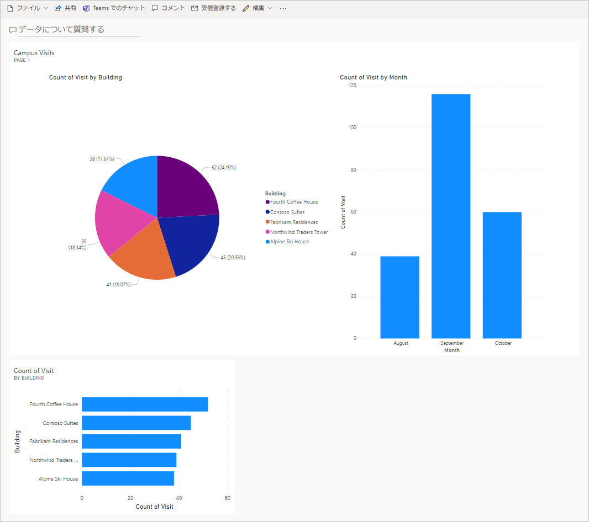

---
lab:
  title: ラボ 7:簡単なダッシュボードを作成する方法
  module: 'Module 5: Get Started with Power BI'
ms.openlocfilehash: 5381acb81a59a46f6eb6aca9f2bde18de9846473
ms.sourcegitcommit: ef58c858463b890e923ef808b1d43405423943fd
ms.translationtype: HT
ms.contentlocale: ja-JP
ms.lasthandoff: 01/27/2022
ms.locfileid: "137899055"
---
# <a name="module-5-get-started-with-power-bi"></a>モジュール 5: Power BI を使い始める
## <a name="lab-how-to-build-a-simple-dashboard"></a>ラボ:簡単なダッシュボードを作成する方法

# <a name="scenario"></a>シナリオ

ベローズ カレッジは、キャンパス内に複数の建物を持つ教育機関です。 キャンパスの訪問者は現在、紙の日誌に記録されています。 その情報は一貫して把握されておらず、キャンパス全体の訪問に関するデータを収集して分析する手段もありません。 

キャンパスの管理者は、建物へのアクセスがセキュリティ担当者によって管理され、すべての訪問者がホストによって事前に登録され、記録されることが要求される訪問者登録システムを近代化したいと考えています。

このコース全体を通して、アプリケーションを構築するとともに自動化を行って、ベローズ カレッジの管理担当者とセキュリティ担当者がキャンパス内の建物へのアクセスを管理および制御できるようにします。 

このラボでは、キャンパス訪問に関するデータを視覚化する Power BI ダッシュボードをビルドします。

# <a name="high-level-lab-steps"></a>ラボ手順の概要

次の手順に従って Power BI ダッシュボードを設計および作成します。

-   Dataverse に接続する
-   関連行について、ユーザーに分かりやすい説明を含むようにデータを変更する (ルックアップ)
-   キャンパス訪問情報の様々な視覚化を用いたレポートの作成と公開を行います。
-   自然言語クエリを使用して、追加で視覚化を行う
-   Power BI ダッシュボードのモバイル ビューを構築する


## <a name="prerequisites"></a>前提条件

* **モジュール 0 ラボ 0 - ラボ環境の検証** の完了
* **モジュール 2 ラボ 1 - Common Data Service の概要** の完了

## <a name="things-to-consider-before-you-begin"></a>始める前に考慮すべきこと

-   このレポートが想定しているのは、どのような利用者層でしょうか?
-   利用者はどのようにレポートを活用しますか? 典型的なデバイスを使っていますか? 場所?
-   視覚化するのに十分なデータがありますか?
-   訪問に関するデータを分析するために使用できる特性は何ですか?

# <a name="exercise-1-create-power-bi-report"></a>演習 \#1:Power BI レポートの作成 

**目的:** この演習では、Dataverse データベースのデータに基づいて Power BI レポートを作成します。

## <a name="task-1-install-power-bi-desktop--prepare-power-bi-service"></a>タスク \#1:Power BI Desktop のインストール/ Power BI サービスの準備

1. Power BI を設定するには、次の手順に従います。 

    - Power BI Desktop が **既に** インストールされている場合は、[タスク \#2](#task-2-prepare-data) に進んでください。
    
    - Power BI Desktop がインストールされていない場合は、**手順 #2** を実行してください。
    
    - 必要なアクセス許可がない場合、または Power BI Desktop の実行に関する問題が発生した場合は、**手順 #4** に進みます。

2. [https://aka.ms/pbidesktopstore](https://aka.ms/pbidesktopstore) に移動し、Power BI Desktop をダウンロードしてインストールします。

    > [!IMPORTANT]
    > Microsoft Store を使用した Power BI Desktop のインストールで問題が発生した場合は、[https://aka.ms/pbiSingleInstaller](https://aka.ms/pbiSingleInstaller) からダウンロードできるスタンドアロン インストーラを試してください。

3. Power BI Desktop が正常にインストールされた場合は、[タスク \#2](#task-2-prepare-data) に進むことができます。それ以外の場合は、次の手順に進みます。

    > デスクトップ アプリケーションのインストールに必要なアクセス許可がない場合、または Power BI Desktop の実行や構成に問題がある場合は、以下のタスク手順を実行してください。

4. [visits.pbix](../../Allfiles/visits.pbix) をダウンロードして、コンピューターに保存します。

5. [https://app.powerbi.com/](https://app.powerbi.com/) に移動して **[サインイン]** をクリックします。 

6. **[マイ ワークスペース]** をクリックします。 

7. **[データの取得]** ページが表示された場合、 **[スキップ]** をクリックします。 

8. **[+ 新規]** を展開し、 **[ファイルのアップロード]** を選択します。

    > [!IMPORTANT]
    > **[+ 新規]** が表示されない場合は、Power BI の新しい外観をアクティブ化する必要がある場合があります。 画面の上部にある **[新しい外観]** を **[オン]** に切り替えます。

9. **[ローカル ファイル]** を選びます。

10. 以前にダウンロードした **visits.pbix** ファイルを見つけて選択します。

11. データの読み込みが完了したら、**訪問** レポートを選択します ([タイプ] が **[レポート]** に設定されていることに注目してください)。

12. **[編集]** をクリックします。 **[編集]** メニュー項目が表示されていない場合は、 **[...]** をクリックしてから、 **[編集]** を選択します。

13. これで、ラボで使用する Power BI サービスがセットアップされました。 [タスク \#3](#task-3-create-chart-and-time-visualizations) に進みます。ただし、このラボ全体を通して、Power BI Desktop ではなく、[https://app.powerbi.com](https://app.powerbi.com) にあるオンラインの Power BI サービスを使用します。

## <a name="task-2-prepare-data"></a>タスク \#2:データの準備

1.  組織の URL を確認します。

    * 新しいタブで、Power Platform 管理センター (<https://admin.powerplatform.com>) に移動します。
    
    * 左側のナビゲーション ページで、[実際の環境] を選択し、新しいターゲット環境を選択します。
    
    * **[詳細]** パネルの **[環境 URL]** を右クリックし、 **[リンク アドレスのコピー]** を選択します。
    
2. Power BI Desktop を開き、プロンプトが表示されたら、指定された資格情報を使用してサインインします。

3. **[データの取得]** を選択してから、 **[その他...]** を選択します。

4. 左にある **[Power Platform]** を選択し、 **[Common Data Service (Legacy)]\(Common Data Service (レガシ)\)** を選択して、 **[接続]** を押します。 プロンプトが表示されたら、指定された資格情報を使用してサインインし、 **[接続]** をクリックします。

5. 先ほどコピーした環境 URL を **[サーバー URL]** フィールドに貼り付け、 **[OK]** をクリックします。

6. **[エンティティ]** ノード を展開し、 **[bc_Building]** と **[bc_Visit]** エンティティを選択して 、 **[読込み]** をクリックします。

7. 左の垂直ツールバーの **[モデル]** アイコンをクリックします。

8. **bc_Building** テーブルから  **bc_Buildingid** 列 をドラッグして、  **bc_Visit** テーブルの **bc_building** 列にドロップします。 これにより、Power BI が関連データの表示に使用できる 2 つのテーブル間のリレーションシップが作成されます。

9. 左側のツールバーの **[レポート]** アイコンを選択します。

10. **[フィールド]** パネル内の **bc_Visits** ノードを展開します。

11. **[bc_Visit]** の横にある **[...]** をクリックし、 **[新しい列]** を選択します。

12. 次のように式を完成させます。

    ```
    Column = RELATED(bc_Building[bc_name])
    ```

    [ENTER] を押します。 これにより、建物名の新しいフィールドが訪問データに追加されます。

13. 先ほど作成した **[列]** フィールドの横の **[...]** をクリックし、 **[名前の変更]** を選択します。 フィールド名として **Building** を入力します。

14. **[bc_visitid]** フィールドの横の **[...]** をクリックし、 **[名前の変更]** を選択します。 フィールド名として「**訪問数**」と入力します。

15. **[bc_scheduledstart]** フィールドの横の **[...]** をクリックし、 **[名前の変更]** を選択します。 フィールド名として **起動** を入力します。

16. **[ファイル] \| [保存]** を押し、任意のファイル名を入力して、作業中のファイルを保存します。

## <a name="task-3-create-chart-and-time-visualizations"></a>タスク #3:グラフと時間の視覚化を作成する

1. **[視覚化]** パネルの円グラフ アイコンを押して、グラフを挿入します。

2. **[建物]** フィールドをドラッグして、 **[凡例]** ボックスにドロップします。

3. **[訪問数]** フィールドをドラッグして、 **[値]** ターゲット ボックスにドロップします。

4. コーナー ハンドルで円グラフのサイズを変更し、すべてのグラフ コンポーネントが表示されるようにします。

5. 円グラフの外側にあるレポートをクリックして選択を解除し、**視覚化** ウィンドウで 積み上げ縦棒グラフ を選択します。 

6. **[訪問数]** フィールドをドラッグして、 **[値]** ターゲット ボックスにドロップします。

7. **[開始]** フィールドをドラッグして、 **[軸]** のターゲット ボックスにドロップします。

8. [視覚化] ウインドウで、**日** と **四半期** の横にある  **[x]** をクリックすると、**年** と **月** の合計のみが表示されます。

9. コーナー ハンドルを使用して、必要に応じてグラフのサイズを変更します。

10. レポートがインタラクティブに動作するかをテストします。

    * 円グラフでさまざまな積み重なったスライスを選択し、時間レポートの変化を見てみましょう。
    
    * 縦棒グラフをクリックします。 下矢印を押して **[ドリルダウン]** モードをオンにし、列を押して次のレベル (月) にドリルダウンします。 これを行うもう 1 つの方法は、リボンの **[データ / ドリル] \| [次のレベルを展開する]** をクリックする方法です。
    
    * 円グラフの変更を確認するには、ドリルアップまたはドリルダウンして、時間縦棒グラフでさまざまなバーを選択します。
    
11. **[ファイル] \| [保存]** を押して進行中の作業を保存します。

# <a name="exercise-2-create-power-bi-dashboard"></a>演習 2:Power BI ダッシュボードを作成する

## <a name="task-1-publish-power-bi-report"></a>タスク #1:Power BI レポートを発行する。

1. リボンの ホーム タブの **発行** ボタンを押します。

2. コピー先として **[マイ ワークスペース]** を選択し、 **[選択]** を押します。

3. 発行が完了するまで待ち、 **[Power BI で \<name of your report\>.pbix を開く]** をクリックします。

## <a name="task-2-create-power-bi-dashboard"></a>タスク #2:Power BI ダッシュボードを作成する

1. 前のタスクからレポートを開く必要があります。

2. メニューの **[ダッシュボードをピン留めする]** を選択します。 レイアウトによっては、追加のメニュー項目を表示するためには **[...]** を押す必要があります。

3. **[ダッシュボードにピン留めする]** プロンプトで、 **[ 新しいダッシュボード]** を選択します。

4. **[ダッシュボード名]** として「 **[姓] キャンパス管理**」と入力し、 **[ライブをピン留めする]** を押します。

5. 上部の **[マイ ワークスペース]** を選択し、 **[[姓] キャンパス管理]** ダッシュボードを選択します。

6. 表示される円グラフと棒グラフがインタラクティブに動作するかをテストします。

## <a name="task-3-add-visualizations-using-natural-language"></a>タスク #3:自然言語を使用した視覚化の追加します。

1. **[キャンパス管理]** ダッシュボードで 、上部の **[データ バーに関する質問]** を選択します。

2. Q&A エリアで、**訪問数別に見る建物** と入力します。 棒グラフが表示されます。

3. **[ビジュアルをピン留めする]** を選択します。

4. **[既存のダッシュボード]** を選択し、 **[[姓]キャンパス管理]** ダッシュボードを選択して、 **[ピン留め]** を押します。

5. **[Q&A を終了]** をクリックします。

自分の **[[姓]キャンパス管理]** ダッシュボードが表示されます。 新しい Q&A ビジュアルを表示するには、下にスクロールする必要がある場合があります。 

ダッシュボードは次のようになります。



## <a name="task-4-build-mobile-phone-view-and-share-a-report-with-a-qr-code"></a>タスク #4:携帯電話ビューを構築し、QR コードでレポートを共有する

1. ダッシュボードで、 **[編集] \| [モバイル レイアウト]** を選択します。

2. 必要に応じてタイルを並べ替えます。

3. 右上にある **モバイル レイアウト** をクリックし、ビュー を **Web レイアウト** に変更します。

4. 上部の **[マイ ワークスペース**] を選択し、[**レポート]** を選択します。

5. **[編集]** を選択し、 **[...]\| [QRコードの生成]** を選択します。

6. "*省略可能:* "モバイル デバイスをお持ちの場合は、iOS と Android の両方のプラットフォームで入手可能な QR スキャナー アプリを使用してコードをスキャンします。 (ログインを求められた場合は、ログインします。 モバイル デバイス上のレポートを移動して調査します。

# <a name="challenges"></a>課題

* キャンパスと建設計画を含むダッシュボードとレポート
* 訪問パターンと傾向を報告および分析
* 滞在時間が長過ぎる訪問者をどう視覚化するか
* 大規模キャンパスでリアルタイムに近い処理を実現するストリーミング Power BI 
