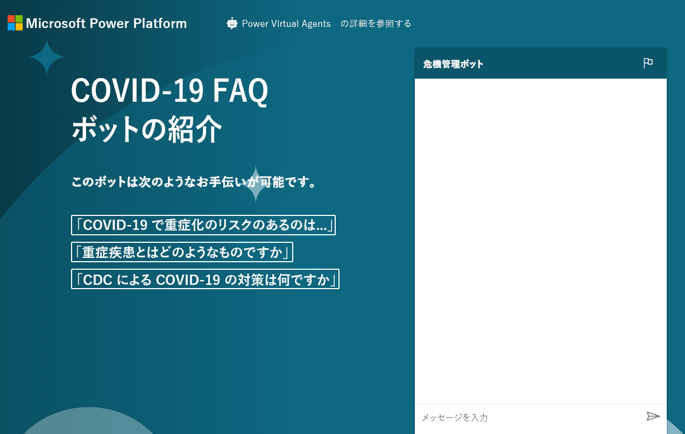

---
lab:
  title: ラボ 8:基本的なチャットボットの構築方法
  module: 'Module 6: Intro to Power Virtual Agents'
ms.openlocfilehash: ed1611f4b1450093a6e95cbb9df7ad7fdc040e86
ms.sourcegitcommit: ef58c858463b890e923ef808b1d43405423943fd
ms.translationtype: HT
ms.contentlocale: ja-JP
ms.lasthandoff: 01/27/2022
ms.locfileid: "137898942"
---
# <a name="module-6-intro-to-power-virtual-agents"></a>モジュール 6:Power Virtual Agents の紹介
## <a name="lab-how-to-build-a-basic-chatbot"></a>ラボ:基本的なチャットボットの構築方法

# <a name="scenario"></a>シナリオ

ベローズ カレッジは、キャンパス内に複数の建物を持つ教育機関です。 キャンパス訪問は現在、紙の記録簿に記録されています。 その情報は一貫して把握されておらず、キャンパス全体の訪問に関するデータを収集して分析する手段もありません。

ほとんどの組織と同様に、Bellows College は COVID-19、ベスト プラクティス、スケジュールなどの誤った情報に関する懸念に迅速に対応しています。 このラボでは、疾病管理センターページを指す Power Virtual Agent チャットボットを構築し、パンデミックの現状に関する質問と回答を示します。 大学では、ポータル サイトに埋め込むことができるように、また部門が独自に計画した再開を行うときにアドホックで利用できるように、この設定が必要です。

## <a name="high-level-steps"></a>手順の概要

次の概要に従って、Power Virtual Agent を構築します。

  - Power Virtual Agent の試用版にサインアップする

  - FAQ を使用してボットを構築する

  - ボットのテスト

  - 既定のあいさつを変更する

  - ボットを発行する

  - **ボーナス チャレンジ:** ポータルにボットを埋め込む

## <a name="prerequisites"></a>前提条件

プロジェクトの完了に必要な要件は次のとおりです。

  - **モジュール 0 ラボ 0 - ラボ環境の検証** の完了

  - **モジュール 2 ラボ 1 - Common Data Service の概要** の完了

  - ボーナス演習のみ:
          **モジュール 6 ラボ 4 - Power Apps ポータルの概要** の完了 

## <a name="things-to-consider-before-you-begin"></a>始める前に考慮すべきこと

ボットは、さまざまなシナリオで非常に役立ちます。 Bellows College についてこれまでの既知の内容に基づいて、ボットが使用される可能性のある組織内の他の場所を検討してください。

# <a name="exercise-1-sign-up-for-pva-and-create-a-new-bot"></a>演習 \#1:PVA にサインアップして新しいボットを作成する

この練習では、Power Virtual Agents の試用版にサインアップします。

1.  [Power Virtual Agents](https://powerva.microsoft.com/) に移動ずる

2.  **無料試用版の開始** をクリックします。

3.  必要に応じて、サインインします。

4. **新しいボットの作成** ウィンドウが表示されます。

5. **名前** に **Crisis Bot** と入力し、言語を選択します。

6. 演習環境 を選択してボットを作成し、**作成** をクリックします。 ボットが作成されるのを待ちます。 プロンプトが表示されたら、 **[ボットの探索]** をクリックします。

7. ボットをテストします。 メッセージ ボックスに「**こんにちは**」と入力し、 **[送信]** をクリックします。 ボットはあなたに挨拶し、それが何ができるかを教えてくれるはずです。

8. **チャット** を閉じます。

9. **[トピック]** を選択します。 ボットには、いくつかのサンプル ユーザー トピックといくつかのシステム トピックが付属しています。 既定のあいさつは、システム トピックからのものです。

> 次の練習では、CDC FAQ サイトから独自のトピックを生成します。 このブラウザーの画面から移動しないでください。

# <a name="exercise-2-create-topics"></a>演習 \#2:トピックを作成する

この演習では、CDC FAQ サイトからトピックを生成します。

1.  新しいタブで、[CDC FAQ](https://www.cdc.gov/coronavirus/2019-ncov/faq.html) サイトに移動し、サイトの内容を確認します。 これらの FAQ からトピックを生成します。

2.  URL をコピーします。

3.  Power Virtual Agents に戻り、**トピック** が選択されていることを確認します。

4.  **[トピック]** の下にある、 **[推奨]** タブを選択します。

5.  **[はじめに]** をクリックします。

6. コピーした URL を **[オンライン コンテンツへのリンク]** テキスト ボックスに貼り付け、 **[追加]** をクリックします。 完全な URL をコピーした場合は、 https:// が 2 回表示されることに注意してください。 URL にプロトコルが 1 回だけ表示されていることを確認します。

7.  **[スタート]** をクリックして待ちます。 これには数分かかることがあります。

8.  いくつかの推奨トピックを作成する必要があります。 クリックすると、推奨トピックのいずれかが開きます。

9. トリガー フレーズとボットの返信が表示されます。 **[トピックに追加] をクリックします。**
    
10. おすすめのトピックをトピックに追加する必要があります。 提案されたトピックをすべて選択し、 **[トピックに追加]** をクリックします 

    > [名前] 列の左側にあるアイコンを使用して、すべてのトピックを選択できます。 エラー メッセージが表示された場合は、もう一度お試しください。

11. おすすめのトピックを追加したら、 **[既存]** タブを選択します。ステータスがオフに設定された新しいトピックが表示されます。

12. **[状態]** 列のトグル ボタンを使用して、一部のトピックを **[オン]** に切り替えます。 

13. 後でテストできるように、オンにしたトピックの 1 つに対するトリガー フレーズを書き留めます。

> このブラウザーの画面から移動しないでください。

# <a name="exercise-3-test-topics"></a>演習 \#3:トピックをテストする

このタスクでは、追加したトピックをテストします。

1.  左下の **[ボットのテスト]** をクリックします。

2.  **[リセット]** をクリックします。

3.  前のタスクで記録したトリガー フレーズを入力し、 **[送信]** をクリックします。

4.  ボットは正しい情報を提供し、質問に答えたかどうかを尋ねる必要があります。 **[はい]** をクリックします。

5.  ボットは、それがどのように行ったかをあなたに尋ねる必要があります。 それに優れた評価を与えます。

6.  ボットは、他の何かを助けることができるかどうかを尋ねる必要があります。 **[いいえ、ありがとう]** をクリックします。

7.  ボットはチャット セッションを終了する必要があります。

8.  「**こんにちは**」と入力し、 **[送信]** をクリックします。

9.  ボットはあなたに挨拶し、それが何ができるかを教えてくれるはずです。 これで COVID-19 に関する FAQ についてユーザーがボットの手助けを受けられるようになりました。次のタスクでは、あいさつメッセージを変更する必要があります。 このブラウザーの画面から移動しないでください。

# <a name="exercise-4-change-the-greeting"></a>演習 \#4:あいさつを変更する

このタスクでは、あいさつを COVID-19 固有に変更します。

1.  **[トピック]** が選択されていることを確認し、 **[既存]** タブを選択します。

2.  **[ユーザー トピック]** セクションを折りたたみます。

3.  クリックすると、システム トピックの **[Greeting]** トピックが開きます。 検索ボックスを使用して、**既存のトピックを検索** することもできます。

4.  あいさつのトピックには 52 個のトリガー フレーズがあり、 **[作成キャンバスに移動]** をクリックします。

5.  最初のメッセージに移動し、`Hi, I’m a virtual agent. I can tell you about how COVID-19 spreads, how to protect yourself, preparing your home and family for COVID-19, symptoms, testing, and more.` に置き換えます。

6.  **[保存]** をクリックします。

7.  ボットがまだ開いていない場合は、 **[ボットのテスト]** をクリックします。 **[リセット]** をクリックして、チャットをリセットします。

8.  「こんにちは」と入力し、 **[送信]** をクリックします。

9.  ボットは、新しいあいさつの応答で返信する必要があります。

# <a name="exercise-5-publish-the-bot"></a>演習 \#5:ボットを公開する

この演習では、ボットを公開します。

1.  左側のナビゲーション バーで **[公開]** を選択します。

2.  **[発行]** をクリックします。

3.  **[公開]** をクリックし、公開が完了するまで待ちます。

4.  左側のナビゲーション バーの **[管理]** を展開し、 **[チャネル]** を選択します。

5.  ボットを公開できるチャネルのリストが表示されます。 **[デモ Web サイト]** を選択します。

6.  ウェルカム メッセージを `Try my COVID-19 FAQ bot.` に変更します。

7.  **[会話の開始点]** に次のように入力します。
    ```
     “Who is at higher risk for serious illness from COVID-19”
     “What does more severe illness mean”
     “What is the CDC doing about COVID-19”
    ```
    
8.  **[保存]** をクリックします。

9.  **URL** をコピーします。

> 同僚と URL を共有し、同僚からフィードバックを得ることができます。 

10.  新しいブラウザーの画面またはタブを起動し、コピーした URL に移動します。 デモの Web サイトは、次の画像のようになります。

11. 先に進み、ボットとのチャットを開始します。  
    
完了すると、公開されたボットは次のようになります。



# <a name="challenges"></a>課題 
* チャットボットをベローズ カレッジ訪問者ポータルに埋め込みます (これを行う方法の詳細については、[こちら](https://docs.microsoft.com/en-us/power-virtual-agents/publication-connect-bot-to-web-channels)の **Power Apps へのボットの追加** に関する記事を参照してください)。
